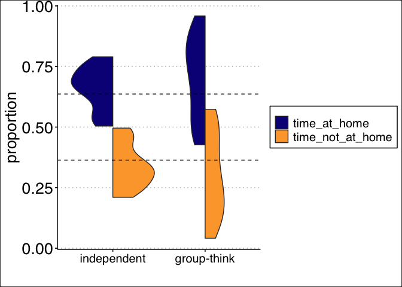
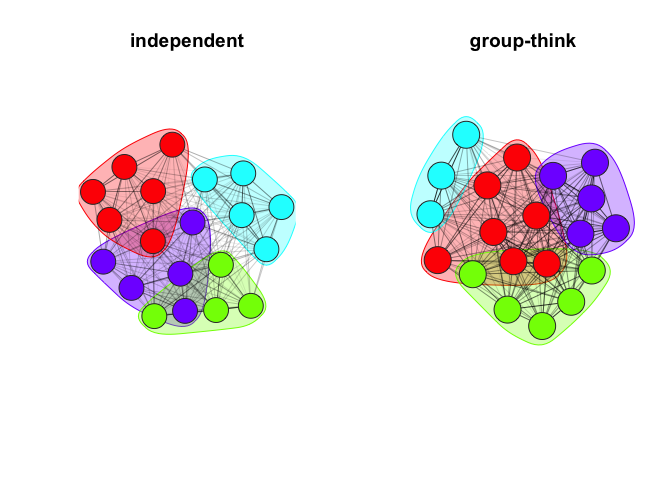
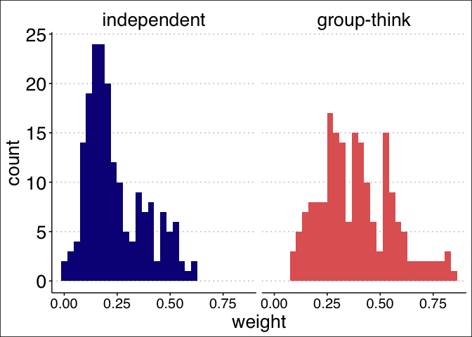
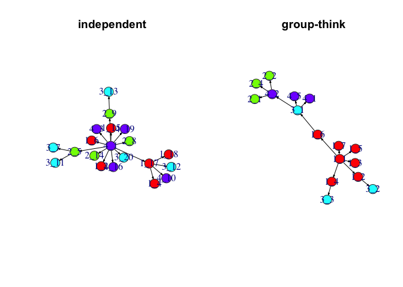

<!-- badges: start -->

[](https://codecov.io/gh/gavincotterill/modulr)
<!-- badges: end -->

# modulr

**NOTE:** This package is under active development. A stable version
will be available soon.

`modulr` is an R package for stochastic simulation of fission-fusion
dynamics and sampling processes. It provides a suite of tools for
creating and working with modular `igraph` networks and investigating
network statistic estimation.

The heart of this package is in its simulators so here we’ll outline how
they operate and look at how they’re different using some additional
tools we’ve incorporated in the package. There’s more to `modulr`
though, so be sure to check out the other vignettes.

Some of the functions in this package can use the ‘netcarto’
simulated-annealing community detection algorithm implemented via
`rnetcarto`, although this is a suggested package, not a dependency.
`rnetcarto` setup can be laborious depending on your machine. In our
experience, this community detection algorithm has the greatest
performance advantages for small networks, which may make the additional
setup effort worthwhile.

## How to cite this package

Cotterill, G. and Manlove, K. modulr: R package for simulating
fission-fusion networks and sample design. (Version v1.0.0).
<https://github.com/gavincotterill/modulr>

## Installation

Currently only available through github. You will need to install and
load `devtools`.

``` r
install.packages("devtools")
devtools::install_github("gavincotterill/modulr")
```

## Simulators

There are currently two simulators in the package called “independent”
and “group-think”. In the independent simulator, changes in group
membership arise from individual-level fission and fusion events that
occur stochastically in accordance with fixed background rates. Each
animal is initially assigned residency in a home group according to a
draw from a discrete uniform distribution. We define an expected time to
fission events, *λ*, that controls the stochastic waiting time to
departure from the home group and an expected time to fusion events,
*ξ*, that controls the stochastic waiting time until the animal returns
to its home group. At the beginning of the simulation, we draw a waiting
time until fission from an exponential distribution with rate parameter
1/*λ*. At that time the individual is assigned to a new group drawn at
random from a set containing all of its non-resident groups.Then another
waiting time is drawn, this time from an exponential distribution
governed by the fusion event rate 1 ⁄ *ξ*, at which time the animal
returns to its resident home group. This procedure is repeated for the
sampling duration.

The combination of switching times and group labels defines a
continuous-time description of the individual’s group membership over
the course of the simulation. The simulation protocol assumes that the
fission and fusion events of particular individuals are independent
(e.g., larger groups do not preferentially split into subgroups;
individuals join and leave groups one-at-a-time). Users must specify
limits on the amount of time it takes for individuals to transition
between groups. The duration of ‘travelling time’ for each transition is
drawn from a uniform distribution using those limits. This flexibility
also allows transitions to be nearly instantaneous and/or fixed at a
precise value. Travelling time is factored into waiting times for the
exponential draws. This means that users should specify travelling times
that are short relative to *λ* and *ξ*, otherwise individuals
potentially spend more time in limbo than with groups. The simulation
procedure is repeated independently for all individuals in the simulated
population. The independent simulator is also spatially-explicit in the
sense that group identity is indistinguishable from a patch location in
its interpretation.

The ‘group-think’ simulator seeks to relax the assumption of independent
switching. It is hierarchical and works in two stages. First, entire
groups switch between the same number of patches using the independent
simulation procedure. Next, groups are populated with resident
individuals that make decisions based on what is happening around them
in terms of group movements and in conjunction with the rates 1/*λ* and
1/*ξ*. It may be helpful to think of this in terms of groups switching
between patches, and individuals switching between groups. At any time
in the simulation there are four possible event types: fission, fusion,
simultaneous fission and fusion or no change among the groups at a given
patch. In a fission event, at least one group departs from a patch
containing at least one other group; fusion is when groups join each
other at a patch; fission-fusion is when groups are both arriving and
departing a patch at the exact same time. Currently the trigger for
individual decision-making is ‘fission’ of either variety: the departure
of any group from multiple co-located groups (i.e., event types fission
or fission-fusion). It is important to note that individuals can be
‘attached’ to a non-resident group while co-located with their resident
group and vice-versa. Individual choice is structured such that, when
*any fission* happens, individuals decide whether to trail off with
those that are departing or stay put. In practice it’s a little more
complicated: individuals that are attached to their resident/home group
have a probability of switching to any of the other previously
co-located groups equal to (1/*λ*)/((1/*λ*)+(1/*ξ*)) and individuals
that are not attached to their resident/home group have a probability of
returning to their respective home groups equal to
(1/*ξ*)/((1/*λ*)+(1/*ξ*)). Individuals returning home ‘magically’ find
their resident group regardless of where they are located and are
subject to the same uniform draw for travelling time. These individual
movements have no bearing on the event types categorizing group
movements (eg., fission, fusion, etc.)

The independent sampler sacrifices some realism for the sake of
tractability, whereas the group-think simulator seeks to add realism but
may need additional refinements.

Let’s compare the simulators. We need to load some additional packages.

``` r
#------ load packages -----
sapply(c("tidyverse", "ggthemes", "igraph", "assortnet", "modulr"), require, character = T)
#> tidyverse  ggthemes    igraph assortnet    modulr 
#>      TRUE      TRUE      TRUE      TRUE      TRUE
```

We start by specifying values. For reproducibility we’ll use
`set.seed()`. Currently all of the ‘time’ components are specified in
days. In the future this could be improved by converting units behind
the scenes.

``` r
ng = 4 # number of groups
na = 20 # number of animals
tl = 7 # time to leave ie. lambda
tr = 4 # time to return ie. xi
tt = c(0.001, 0.002) # nearly instantaneous travel times, these are in days
# 86400 seconds per day
# 86400 * 0.001 is about 1.5 minutes, so the range here is one and a half to three minutes 
sd = 100 # sampling duration in days

set.seed(1234)
```

The object names here could also be made a little more intuitive. Like
‘at’… came from ‘animals_transformed’ which will be deprecated. These
could be ind_sched and gt_sched or something like that.

``` r
at_ind <- simulate_schedule(n_animals = na, n_groups = ng, time_to_leave = tl, 
                            time_to_return = tr, travel_time = tt, 
                            sampling_duration = sd,
                            simulator = "independent")

at_non_ind <- simulate_schedule(n_animals = na, n_groups = ng, time_to_leave = tl, 
                                time_to_return = tr, travel_time = tt, 
                                sampling_duration = sd,
                                simulator = "group-think")

head(at_ind[[1]], 6)
#>    state    start      end
#> 1: 4.000 0.000000 1.712192
#> 2: 0.009 1.712192 1.714192
#> 3: 2.000 1.714192 3.042197
#> 4: 0.016 3.042197 3.044197
#> 5: 4.000 3.044197 3.673665
#> 6: 0.086 3.673665 3.674665
head(at_non_ind[[1]], 6)
#>    state     start       end
#> 1:     1  0.000000  7.992838
#> 2:     1  7.992838  7.994838
#> 3:   1-3  7.994838  8.272769
#> 4:     3  8.272769  8.273769
#> 5:     3  8.273769 10.058696
#> 6:     3 10.058696 10.059696
```

Each of these schedule objects is a list of data.frames: one per
individual, detailing where they were with time intervals. The time
intervals are the same for each individual, regardless of whether or not
they moved, which is why there are some rows where the state doesn’t
change. In the first case (independent) location is synonymous with
group, which preserves the spatially-explicit nature. In the second case
(group-think), as it’s currently coded, the state reflects the vector of
co-located groups where the individual was. Behind the scenes we also
have the true location, but for now we’re not doing anything else with
it. In that sense, we’ve lost track of space. We can use these lists,
along with the `get_times()` function, to calculate the average amount
of time that individuals spend with their home group vs away from their
home group. Ideally the average proportion of time individuals spend
with their home group would be equal to *λ*/(*λ*+*ξ*).

``` r
### get times from independent
ids2 <- names(at_ind)
out2 <- get_times(schedule = at_ind[[1]],
                 id = ids2[[1]],
                 simulator = "independent")
for(i in 2:length(ids2)){
  out2[i, ] <- get_times(at_ind[[i]],
                        ids2[[i]],
                        simulator = "independent")
}

paste("For the \'independent\' simulator, the average proportion of time that individuals spent at their home location was ", 
      mean(out2$time_at_home) %>% round(., 2), 
      ", versus the desired value of ", 
      round(tl / (tl+tr), 2))
#> [1] "For the 'independent' simulator, the average proportion of time that individuals spent at their home location was  0.66 , versus the desired value of  0.64"
```

In this ‘independent’ simulation, on average, individuals spent 66% of
their time with their home group versus the 64% we specified. That’s
pretty close. Let’s perform the same calculation for the ‘group-think’
simulation.

``` r
### get time from group-think
ids <- names(at_non_ind)

out <- get_times(schedule = at_non_ind[[1]],
                 id = ids[[1]],
                 simulator = "group-think")
for(i in 2:length(ids)){
  out[i, ] <- get_times(at_non_ind[[i]],
                        ids[[i]],
                        simulator = "group-think")
}
paste("For the \'group-think\' simulator, the average proportion of time that individuals spent with their preferred group was ", 
      mean(out$time_at_home) %>% round(., 2), 
      ", versus the desired value of ", 
      round(tl / (tl+tr), 2))
#> [1] "For the 'group-think' simulator, the average proportion of time that individuals spent with their preferred group was  0.7 , versus the desired value of  0.64"
```

In this group think simulation, on average, individuals spent 70% of
their time with their home group versus the 64% we specified. That
doesn’t seem too far off, but it’s worse than the independent simulator.
Now let’s reformat the data and visualize the results using density
plots. Below I’ve borrowed ‘split violin’ code from:
<https://stackoverflow.com/questions/35717353/split-violin-plot-with-ggplot2>.

``` r
out_both <- out %>%
  dplyr::mutate(sim = "group-think") %>%
  rbind(out2 %>% dplyr::mutate(sim = "independent"))

df <- data.frame(x = 1/(tl+tr) * tl,
                 y = 1/(tl+tr) * tr)

out3 <- out_both %>%
  tidyr::gather(state, proportion, 3:4)

out3$sim <- factor(out3$sim, levels = c("independent", "group-think"))

ggplot(out3) +
  geom_split_violin(aes(x = sim, y = proportion, fill = state)) +
  scale_fill_viridis_d(option = "plasma", end = 0.8) +
  geom_hline(aes(yintercept = tl/(tl+tr)), lty = 2)+
  geom_hline(aes(yintercept = tr/(tl+tr)), lty = 2)+
  labs(x = "") + 
  theme_clean() +
  theme(legend.title = element_blank(),
        legend.text = element_text(size = 15),
        axis.title = element_text(size = 20),
        axis.text.x = element_text(size = 15),
        axis.text.y = element_text(size = 20))
```



This is interesting and also disappointing. It looks like both tend to
put animals in their home groups more than they should. It might not be
significantly off using the independent simulator. The group think
simulator, on the other hand, looks super noisy. Those values are all
over the place. Does that render this simulator worthless as-is?

Let’s compare the graphs of these two networks side-by-side:

``` r
gc_at <- graph_from_schedule(at_ind)
gc_at2 <- graph_from_schedule(at_non_ind)

par(mfrow = c(1,2))
plot_simulated_graph(gc_at, title = "independent")
plot_simulated_graph(gc_at2, vertex.size = 35, title = "group-think")
```



These are actually more similar than I would have imagined and require
additional introduction. Here, each circle (or node) represents an
individual. The color of the node represents it’s home group and the
polygon encircling nodes of the same color are an additional aid in
visualizing group memberships. The darkness of the lines indicate the
edge weights – that is, darker lines mean more time spent together.
Between the two graphs we have the same number of individuals and the
same number of groups, but these are two totally different simulations
so under the best of circumstances they will still be different in terms
of how many animals are in each group and the arrangement of colors.
However, what is potentially meaningful are differences in terms of how
the communities here segregate or don’t and the edge weights. Overall it
looks like there’s a similar amount of overlap between different groups,
but the edge weights on the right graph (group-think) look darker. It
might be that these graphs have similar modularity, although the
distributions of edge weights might be quite different.

Let’s look at the distribution of edge weights from these two graphs:

``` r
ew_ind <- igraph::E(gc_at)$weight
ew_non_ind <- igraph::E(gc_at2)$weight

df2 <- data.frame(weight = c(ew_ind, ew_non_ind), 
                  sim = c(rep("independent", length(ew_ind)), 
                          rep("group-think", length(ew_non_ind))))
df2$sim = factor(df2$sim, levels = c("independent", "group-think")) 

ggplot(df2)+
  geom_histogram(mapping = aes(x = weight, fill = sim), show.legend = FALSE)+
  scale_fill_viridis_d(option = "plasma", end = 0.6) +
  facet_wrap(~sim)+
  theme_clean()+
  theme(axis.title = element_text(size = 20),
        axis.text.x = element_text(size = 15),
        axis.text.y = element_text(size = 20),
        strip.text = element_text(size = 20))
#> `stat_bin()` using `bins = 30`. Pick better value with `binwidth`.
```



``` r
mean(ew_ind)
#> [1] 0.2398493
mean(ew_non_ind)
#> [1] 0.3893899
```

It looks like individuals in the group-think simulation spend a lot more
time together. It looks like there were never any zero edge weights and
some pairs almost never split up. This is strange. Let’s compare
modularity.

``` r
adj_ind <- as.matrix(igraph::get.adjacency(gc_at, type = "upper", attr = "weight"))
mem_ind <- V(gc_at)$membership
assortnet::assortment.discrete(adj_ind, types = mem_ind, weighted = T)$r
#> [1] 0.211443

adj_grp <- as.matrix(igraph::get.adjacency(gc_at2, type = "upper", attr = "weight"))
mem_grp <- V(gc_at2)$membership
assortnet::assortment.discrete(adj_grp, types = mem_grp, weighted = T)$r
#> [1] 0.181312
```

The intrigue continues… we have two simulators that operate pretty
differently. The independent simulator has individuals bounce around
without being influenced in any way by other animals. The group-think
simulator follows rules that ensure “stickiness” – that individuals will
follow each other around more. With that being the case, we should
expect the distribution of edge weights to be higher in group-think (at
least within group). The results from the split violin plot are
concerning. The close similarity in modularity values is reassuring. It
would certainly be worth repeating this many times to see if any of
these results are anomolous, or whether they represent a consistent
pattern.

An additional comparison to make would be in graph-crossing time and/or
in simulating disease across these networks. To these, we need to
specify some additional terms. We’ll calculate the graph crossing times
first. What do you expect to happen?

I would guess that the independent sampler produces more even mixing
than group-think. That fits with the idea that individuals in
group-think are ‘stickier’ or don’t make as many meaningful moves
between groups. On the other hand, group-think had no zero edge weights.
Modularity was similar, although slightly higher with the independent
simulator, which might suggest slower transmission across the graph.

This part will be slow. Also, I’m suppressing warnings from
graph_crossing on at_non_ind… so I need to chase down what’s happening
there.

``` r
# exposure time, here it's zero because I want instantaneous 'transmission' 
et = 0 
# infectious time, here it's 100 which is probably overkill, 
# but to be safe it's the same as the sampling duration
it = sd 

# I randomly allocate the first individual in the list to be the index case
index_ind <- names(at_ind)[[1]]
gc_ind <- graph_crossing(schedule = at_ind, 
                         exposure_time = et, 
                         infectious_time = it, 
                         index_case = index_ind)
#> [1] "There are 20 animals in memo at the beginning of time_step 1"
#> [1] "There are 19 animals in memo the beginning of time_step 2"

index_non_ind <- names(at_non_ind)[[1]]
gc_non_ind <- graph_crossing(schedule = at_non_ind, 
                             exposure_time = et, 
                             infectious_time = it, 
                             index_case = index_non_ind)
#> [1] "There are 20 animals in memo at the beginning of time_step 1"
#> [1] "There are 19 animals in memo the beginning of time_step 2"

# the graph crossing time is:
max(gc_ind$time_infected)
#> [1] 16.05649
max(gc_non_ind$time_infected)
#> [1] 62.44119
```

Huge difference. 16 days with the independent simulator vs 64 days with
group-think. Clearly pathogens requiring close contact would rip through
the former much faster than the latter. This is despite nearly identical
modularity values. There’s also an element of chance, as we have to
specify an index case which will stochastically shape the outcome. We at
least intended to have the same group-switching rates between the two
simulators, although whether we adequately do that may be in doubt. We
can say for sure that group-think is much noisier in this respect. Let’s
plug in exposure and infectious times that might mimic a common cold and
then plot the transmission chains.

``` r
et = 2 # exposure time
it = 5 # infectious time

seir_ind <- graph_crossing(schedule = at_ind, 
                           exposure_time = et, 
                           infectious_time = it, 
                           index_case = index_ind)
#> [1] "There are 20 animals in memo at the beginning of time_step 1"
#> [1] "There are 19 animals in memo the beginning of time_step 2"
seir_non_ind <- graph_crossing(schedule = at_non_ind, 
                               exposure_time = et, 
                               infectious_time = it, 
                               index_case = index_non_ind)
#> [1] "There are 20 animals in memo at the beginning of time_step 1"
#> [1] "There are 19 animals in memo the beginning of time_step 2"
#> [1] "ran out of new exposures at timestep 2"

# independent sampler
nrow(seir_ind) # all individuals infected 
#> [1] 20
max(seir_ind$time_infected) # in 11 days
#> [1] 10.8744

# group-think
nrow(seir_non_ind) # epidemic fades out after 16/20 were infected
#> [1] 16
max(seir_non_ind$time_infected) # and it took 17 days
#> [1] 16.54561

# this could be incorporated in the plot_transmissions code down the road:
g_seir_ind <- igraph::graph_from_edgelist(seir_ind[,1:2] %>% as.matrix())
g3 <- igraph::graph_from_edgelist(seir_ind[-1,1:2] %>% as.matrix())
V(g3)$membership <- stringr::str_extract(V(g3)$name, "\\d{1,}(?=_)") %>% as.numeric()

# for now its ok
g_seir_non_ind <- igraph::graph_from_edgelist(seir_non_ind[,1:2] %>% as.matrix())
g4 <- igraph::graph_from_edgelist(seir_non_ind[-1,1:2] %>% as.matrix())
V(g4)$membership <- stringr::str_extract(V(g4)$name, "\\d{1,}(?=_)") %>% as.numeric()

par(mfrow = c(1,2))
plot_transmissions(g3, title = "independent", 
                   vertex.size = 80,
                   vertex.label = V(g3)$name,
                   vertex.label.cex = .5)
plot_transmissions(g4, title = "group-think",
                   vertex.size = 80,
                   vertex.label = V(g4)$name,
                   vertex.label.cex = .5)
```



Based on the graph-crossing time I would have thought there’d be an even
bigger difference, but in general it’s what we should have expected. In
the independent sampler, due to its more even mixing, we have every
individual contracting the disease in less time. By contrast, not all
individuals became infected in the group-think simulator and the
pathogen tended to knock out groups in series. Group 1 (red) were all
infected, then group 3 (blue), then group 4 (purple), then last group 2
(green).

In summary, the independent simulator looks pretty robust. Right now the
jury may still be out on group-think. Are the differences just the
result of unreliable handling of group switching rates and/or too much
random noise? Or is there value in a simulator that produces networks
with the similar modularity yet totally different individual behavior?

I wonder if some of this noise could be reduced by more explicitly
double-dipping on the switching rates. In that case, rather than having
fission trigger individual choice, keep a record of the exponential
draws of groups among patches, and use those again on the individual
level. That would overwrite the element of animal cognition that I was
originally striving for and might just induce other issues I’m not
seeing. I’ve also wondered if the only missing piece is that individuals
that are not at home and not at the same patch as their resident group
need the opportunity to be ‘called home’ when their group undergoes
fission.

One thing I haven’t done is to look at group-think in terms of patch
fidelity. A clear alternative, and probably more realistic, is that
animals returning home would go to the preferred patch, rather than
‘magically’ find their group. That raises some additional questions, but
I think the way to do it would be to have them automatically lock on to
their group if the group is at the patch or arrives at the patch and
otherwise randomly assign them to any group that might appear. Another
consideration is that the patch could remain unoccupied by ‘groups’
while an individual (or multiple individuals) are there. It would be
easy to force them to sit and wait until their friends show up, but I
wonder how if it changes much that they’re potentially stuck there a
while.
