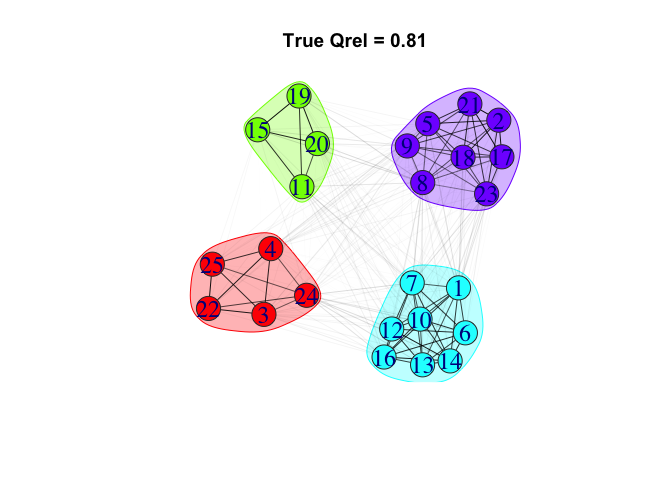

<!-- badges: start -->

[](https://codecov.io/gh/gavincotterill/modulr)
<!-- badges: end -->

# modulr

`modulr` is an R package for stochastic simulation of fission-fusion
dynamics and sampling processes. It provides a suite of tools for
creating and working with modular `igraph` networks and investigating
network statistic estimation.

If using the ‘netcarto’ simulated-annealing community detection
algorithm implemented via `rnetcarto`, additional setup is required that
can be laborious, especially for Windows OS. In our experience, this
community detection algorithm has the greatest performance advantages
for small networks, which may make the additional setup effort
worthwhile.

## How to cite this package

Cotterill, G. and Manlove, K. modulr: R package for simulating
fission-fusion networks and sample design. (Version v1.0.0).
<https://github.com/gavincotterill/modulr>

## Installation

Currently only available through github. You will need to install and
load `devtools`.

``` r
install.packages("devtools")
devtools::install_github("gavincotterill/modulr")
```

## Simulators

There are currently two simulators in the package called “independent”
and “group-think”. In the independent simulator, changes in group
membership arise from individual-level fission and fusion events that
occur stochastically in accordance with fixed background rates. Each
animal is initially assigned residency in a home group according to a
draw from a discrete uniform distribution. We define an expected time to
fission events, *λ*, that controls the stochastic waiting time to
departure from the home group and an expected time to fusion events,
*ξ*, that controls the stochastic waiting time until the animal returns
to its home group. At the beginning of the simulation, we draw a waiting
time until fission from an exponential distribution with rate parameter
1/*λ*. At that time the individual is assigned to a new group drawn at
random from a set containing all of its non-resident groups.Then another
waiting time is drawn, this time from an exponential distribution
governed by the fusion event rate 1 ⁄ *ξ*, at which time the animal
returns to its resident home group. This procedure is repeated for the
sampling duration.

The combination of switching times and group labels defines a
continuous-time description of the individual’s group membership over
the course of the simulation. The simulation protocol assumes that the
fission and fusion events of particular individuals are independent
(e.g., larger groups do not preferentially split into subgroups;
individuals join and leave groups one-at-a-time). Users must specify
limits on the amount of time it takes for individuals to transition
between groups. The duration of ‘travelling time’ for each transition is
drawn from a uniform distribution using those limits. This flexibility
also allows transitions to be nearly instantaneous and/or fixed at a
precise value. Travelling time is factored into waiting times for the
exponential draws. This means that users should specify travelling times
that are short relative to *λ* and *ξ*, otherwise individuals
potentially spend more time in limbo than with groups. The simulation
procedure is repeated independently for all individuals in the simulated
population. The independent simulator is also spatially-explicit in the
sense that group identity is indistinguishable from a fixed location in
its interpretation.

The ‘group-think’ simulator seeks to relax the assumption of independent
switching. It is hierarchical and works in two stages. First, entire
groups switch between the same number of locations using the independent
simulation procedure. Next, groups are populated with resident
individuals that make decisions based on what is happening around them
in terms of group movements and in conjunction with the rates 1/*λ* and
1/*ξ*. It may be helpful to think of this in terms of groups switching
between locations, and individuals switching between groups. At any time
in the simulation there are four possible event types: fission, fusion,
simultaneous fission and fusion or no change in which groups are
co-located. In a fission event, at least one group departs from a
location containing at least one other group; fusion is when groups join
each other at a location; fission-fusion is when groups are both
arriving and departing a shared location at the exact same time.
Currently the trigger for individual decision-making is ‘fission’ of
either variety: the departure of any group from multiple co-located
groups (i.e., event types fission or fission-fusion). It is important to
note that individuals can be ‘attached’ to a non-resident group while
co-located with their resident group and vice-versa. Individual choice
is structured such that, when *any fission* happens, individuals decide
whether to trail off with those that are departing or stay put. In
practice it’s a little more complicated: individuals that are attached
to their resident/home group have a probability of switching to any of
the other previously co-located groups equal to
(1/*λ*)/((1/*λ*)+(1/*ξ*)) and individuals that are not attached to their
resident/home group have a probability of returning to their respective
home groups equal to (1/*ξ*)/((1/*λ*)+(1/*ξ*)). Individuals returning
home ‘magically’ find their resident group regardless of where they are
located and are subject to the same uniform draw for travelling time.
These individual movements have no bearing on the event types
categorizing group movements (eg., fission, fusion, etc.)

The independent sampler sacrifices some realism for the sake of
tractability, whereas the group-think simulator seeks to add realism but
may need additional refinements.

Let’s compare the simulators.

``` r
#------ load packages -----
sapply(c("tidyverse", "igraph", "assortnet", "modulr"), require, character = T)
#> tidyverse    igraph assortnet    modulr 
#>      TRUE      TRUE      TRUE      TRUE
```

``` r
library(ggplot2)
library(ggthemes)

ng = 4 # number of groups
na = 20 # number of animals
tl = 7 # time to leave
tr = 4 # time to return
# tt = c(0.001, 1) # longer travel times
tt = c(0.0001, 0.0002) # nearly instantaneous travel times
sd = 100 # sampling duration
et = 2 # exposure time
it = 5 # infectious time

set.seed(1234)
at_ind <- simulate_schedule(n_animals = na, n_groups = ng, time_to_leave = tl, time_to_return = tr, travel_time = tt, sampling_duration = sd,
                            simulator = "independent")

at_non_ind <- simulate_schedule(n_animals = na, n_groups = ng, time_to_leave = tl, time_to_return = tr, travel_time = tt, sampling_duration = sd,
                                simulator = "group-think")

### get time from non-ind
ids <- names(at_non_ind)

out <- get_times(schedule = at_non_ind[[1]],
                 id = ids[[1]],
                 simulator = "group-think")
for(i in 2:length(ids)){
  out[i, ] <- get_times(at_non_ind[[i]],
                        ids[[i]],
                        simulator = "group-think")
}
paste("For the \'group-think\' simulator, the average proportion of time that individuals spent with their preferred group was ",
      mean(out$time_at_home) %>% round(., 2), ", versus the desired value of ", round(tl / (tl+tr), 2))
#> [1] "For the 'group-think' simulator, the average proportion of time that individuals spent with their preferred group was  0.7 , versus the desired value of  0.64"

### get times from ind
ids2 <- names(at_ind)
out2 <- get_times(schedule = at_ind[[1]],
                 id = ids2[[1]],
                 simulator = "independent")
for(i in 2:length(ids2)){
  out2[i, ] <- get_times(at_ind[[i]],
                        ids2[[i]],
                        simulator = "independent")
}

paste("For the \'independent\' simulator, the average proportion of time that individuals spent at their home location was ",
      mean(out2$time_at_home) %>% round(., 2), ", versus the desired value of ", round(tl / (tl+tr), 2))
#> [1] "For the 'independent' simulator, the average proportion of time that individuals spent at their home location was  0.66 , versus the desired value of  0.64"

out_both <- out %>%
  dplyr::mutate(sim = "non-ind") %>%
  rbind(out2 %>% dplyr::mutate(sim = "ind"))

df <- data.frame(x = 1/(tl+tr) * tl,
                 y = 1/(tl+tr) * tr)


out3 <- out_both %>%
  tidyr::gather(state, proportion, 3:4)

ggplot(out3) +
  geom_split_violin(aes(x = sim, y = proportion, fill = state)) +
  scale_fill_viridis_d(option = "plasma", end = 0.8) +
  geom_hline(aes(yintercept = tl/(tl+tr)), lty = 2)+
  geom_hline(aes(yintercept = tr/(tl+tr)), lty = 2)+
  theme_clean() +
  # guides(fill = guide_legend(title = "")) +
  theme(legend.title = element_blank(),
        legend.text = element_text(size = 15),
        axis.title = element_text(size = 20),
        axis.text.x = element_text(size = 15),
        axis.text.y = element_text(size = 20))
```



## Workflow

Using either simulator:

1.  Consider a range plausible ‘true’ network configurations for your
    focal species. This includes network size (e.g., population size),
    number of subgroups (e.g., social groups), a range of
    group-switching rates and the duration of the period to track
    animals (e.g., a month, a year, etc.).

2.  Consider how animals are tracked. How many individuals will be
    tracked? How frequently will they be observed? Will individuals be
    selected from the population for tracking at random? Or in a
    stratified or clustered fashion? Additional choices will need to be
    made like the use of community detection algorithm.

3.  With these choices made, simulate a number of ‘true’ networks using
    `simulate_graph()` and calculate the desired network statistic(s).

4.  For each true network, simulate a number of sampling events using
    `sample_graph()` and estimate the desired network statistic(s)

5.  Visualize the results!
