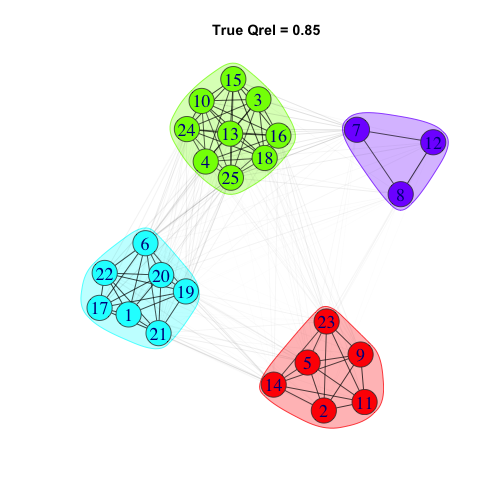
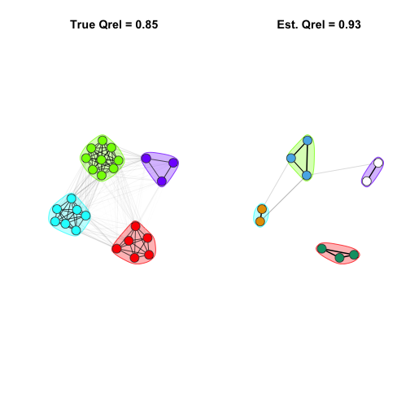
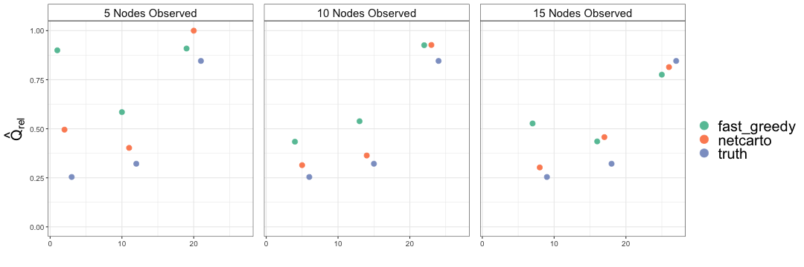

# modulr
`modulr` is an R package for simulating fission-fusion dynamics as a continuous-time Markov process. It allows users to build `igraph` network graphs with controllable modularity and size. It further simulates sampling designs motivated by prevailing wildlife research methods to facilitate the estimation of network statistics through bootstrapping and optimize study design. 

If using the 'netcarto' simulated-annealing community detection algorithm implemented via `rnetcarto`, additional setup is required that can be laborious, especially for Windows OS. In our experience, this community detection algorithm has the greatest performance advantages for small networks, which may make the additional setup effort worthwhile. 

## How to cite this package

Cotterill, G., & K. Manlove (2022). modulr: R package for simulating fission-fusion networks and sample design. (Version v0.8.0). https://github.com/gavincotterill/modulr

## Installation
Currently only available through github. You will need to install and load `devtools`.


```r
install.packages("devtools")
library(devtools)
install_github("gavincotterill/modulr")
```

## Use
A typical workflow consists of several steps:

1) Consider a range plausible 'true' network configurations for your focal species. This includes network size (eg population size), number of subgroups (eg social groups), and a range of group-switching rates, and the duration of the period to track animals (eg a month, a year).

2) Consider how animal tracking proceeds. How many individuals will be tracked? How frequently will they be observed? Will individuals be selected for tracking at random? Or in a stratified or clustered fashion? Additional choices will need to be made like the use of community detection algorithm.

3) With these choices made, simulate a number of 'true' networks using `simulate_graph()` and calculate the desired network statistic(s).

4) For each true network, simulate a number of sampling events using `sample_graph()` and estimate the desired network statistic(s)

5) Visualize the results!


```r
set.seed(123)

#------ define true network configurations -------
true_design <- expand.grid(nNodes = 25, nModules = 4, ttlg = c(10), ttrg = c(1, 5, 7)) %>%
  filter(ttlg > ttrg) %>%
  mutate(graph_id = row.names(.),
         qrel = NA)

#------ simulate your true networks --------
# additional arguments:
dur = 30 # how long to track animals in the population
smpl = "discrete" # for expediency, we'll sample in discrete time. The other option is "continuous".
spd = 2 # Because we're discrete, we need to specify samples per day. Adjust this as you see fit.

# We recommend parallelizing your code, see vignettes for examples.
actual_graphs <- list()
for(p in 1:nrow(true_design)){
  actual_graphs[[p]] <- simulate_graph(n_animals = true_design$nNodes[p],
                                       n_groups = true_design$nModules[p],
                                       time_to_leave = true_design$ttlg[p],
                                       time_to_return = true_design$ttrg[p],
                                       sampling_duration = dur,
                                       sampler = smpl,
                                       samples_per_day = spd)
}


#----- calculate qrel for each network -----
# we use `assortnet` for this
for(m in 1:length(actual_graphs)){
  sim_igraph <- actual_graphs[[m]]
  adj_mat <- igraph::as_adjacency_matrix(sim_igraph, type = "upper", attr = "weight") %>% as.matrix()
  true_design$qrel[m] <- assortnet::assortment.discrete(adj_mat, types = V(sim_igraph)$membership, weighted = T)$r
}

# at this point you can check to see what you've got
g <- actual_graphs[[1]]
plot_simulated_graph(g, vertex.label = V(g), title = paste0("True Qrel = ", round(true_design[1, "qrel"], 2)))
```



This is a good check of our work so far. We should have 4 modules, and 25 nodes. Furthermore, the Fruchterman-Reingold layout should show us 4 distinct communities, since the group-switching rates we used ensure reasonably high modularity.

Labeling the nodes (aka vertices) as we've done here can be useful. And we can access the community membership of the graph in the normal `igraph` fashion:


```r
V(g)$membership
```

```
##  [1] 3 1 2 2 1 3 4 4 1 2 1 4 2 1 2 2 3 2 3 3 3 3 1 2 2
```

Note that for the true memberships, no community detection algorithm is needed. Each individual was assigned based on a random draw from a uniform distribution initially. 


```r
#----- create sampling/study design ------
df_nNodes <- data.frame(sample_nNodes = c(5, 10, 15))

# for simplicity, all of our animals will be observed 5 times during the month
study_design <- tidyr::crossing(true_design, df_nNodes) %>%
  filter(sample_nNodes <= nNodes) %>%
  mutate(prop_hi_res = 1,
         hi_res = 10/365,
         lo_res = 5/365,
         qrel_sim = NA,
         nModules_sim = NA)
```

### Now we're ready to do some sampling
Let's compare what we get back for modularity estimates using two different community detection algorithms, "netcarto" and "fast_greedy".


```r
#------- sample using the 'grab-two' clustered algorithm ---------

# we'll compare netcarto to fast_greedy
out_nc <- list()
for(i in 1:nrow(study_design)){
  
  graph_id <- as.numeric(study_design[[i, "graph_id"]])
  
  g_obs <- sample_graph(graph = actual_graphs[[graph_id]],
                        sample_nNodes = study_design$sample_nNodes[i],
                        prop_hi_res =  study_design$prop_hi_res[i],
                        hi_res = study_design$hi_res[i],
                        lo_res = study_design$lo_res[i],
                        regime = "grab-two",
                        alg = "netcarto")
  
  am_obs <- get.adjacency(g_obs, type = "upper", attr = "sim_weight") %>% as.matrix()
  try({
    if( !is.null(V(g_obs)$membership) ){
      colorOrder <- V(g_obs)$membership
    }
  })
  dat <- study_design[i,] %>%
    mutate(qrel_sim = ifelse(exists("colorOrder"),
                             assortnet::assortment.discrete(am_obs, types = colorOrder, weighted = T)$r,
                             -666),
           nNodes_sim = ncol(am_obs), # might as well keep this in for now, double check that things are working
           nModules_sim = ifelse(exists("colorOrder"), length(unique(colorOrder)), -666))
  
  out_nc[[i]] <- list(dat, g_obs)
}

out_fg <- list()
for(i in 1:nrow(study_design)){

  graph_id <- as.numeric(study_design[[i, "graph_id"]])
  
  g_obs <- sample_graph(graph = actual_graphs[[graph_id]],
                        sample_nNodes = study_design$sample_nNodes[i],
                        prop_hi_res =  study_design$prop_hi_res[i],
                        hi_res = study_design$hi_res[i],
                        lo_res = study_design$lo_res[i],
                        regime = "grab-two",
                        alg = "netcarto")
  
  am_obs <- get.adjacency(g_obs, type = "upper", attr = "sim_weight") %>% as.matrix()
  try({
    if( !is.null(V(g_obs)$membership) ){
      colorOrder <- V(g_obs)$membership
    }
  })
  dat <- study_design[i,] %>%
    mutate(qrel_sim = ifelse(exists("colorOrder"),
                             assortnet::assortment.discrete(am_obs, types = colorOrder, weighted = T)$r,
                             -666),
           nNodes_sim = ncol(am_obs), # might as well keep this in for now, double check that things are working
           nModules_sim = ifelse(exists("colorOrder"), length(unique(colorOrder)), -666))
  
  out_fg[[i]] <- list(dat, g_obs)
}


#------- investigate results ----------

res_nc <- lapply(out_nc, function(x) x[[1]]) %>%
  bind_rows() %>%
  mutate(regime = "grab-two",
         alg = "netcarto")

res_fg <- lapply(out_fg, function(x) x[[1]]) %>%
  bind_rows() %>%
  mutate(regime = "grab-two",
         alg = "fast_greedy")

res <- bind_rows(res_nc, res_fg)

# if there's only one module detected, impose qrel=0:
res <- res %>% mutate(qrel_sim = ifelse(qrel_sim == "NaN" & nModules_sim == 1, 0, qrel_sim))
# if the number of modules = the number of nodes (or nodes - 1 bc there's one edge), impose qrel = 1
res  <- res  %>%  mutate(qrel_sim = ifelse(qrel_sim == "NaN" & nModules_sim  %in% c(nNodes_sim, nNodes_sim - 1), 1, qrel_sim))

# calculate proportion of the population sampled 
res$prop_sampled <- round(res$sample_nNodes / res$nNodes, 2)

# calculate diff in estimate and truth
res$error <- res$qrel_sim - res$qrel

#------ plot a true network next to a sample of that network -----
par(mfrow = c(1,2))
plot_simulated_graph(actual_graphs[[1]], title = paste0("True Qrel = ", round(true_design[1, "qrel"], 2)))
plot_sampled_graph(g = actual_graphs[[1]], g_obs = out_nc[[2]][[2]], title = paste0("Est. Qrel = ", round(res_nc[2, "qrel_sim"], 2)))
```



We are intentionally providing an example where netcarto really shines. `plot_sampled_graph()` preserves the layout from the corresponding 'true' network (which is why you have to provide that as the first argument). This means that the nodes are in the same place so we can see who was sampled, and the surrounding polygons are the same color indicating the 'true' community membserhip. Lastly, the node color in `plot_sampled_graph()` shows us the communities that were assigned using the algorithm we selected. These will be new colors, and in this case they tell us that each individual (node) was correctly grouped!

We've already calculated our Qrel (modularity) estimates after sampling, so the last step is to assess how well these sampling designs (in conjunction with the community detection algorithms) performed.

```r
alg_names <- c(netcarto = "\"netcarto\"", fast_greedy = "\"fast_greedy\"")
points_df <- res %>% select(qrel, qrel_sim, nNodes_sim, alg)
truth <- points_df %>% 
  slice(1:(nrow(res)/length(unique(alg)))) %>%
  select(qrel, nNodes_sim) %>%
  mutate(alg = "truth")
points <- merge(points_df, truth, all = T) %>%
  mutate(qrel_sim = ifelse(qrel_sim %in% NA, qrel, qrel_sim))


points %>%
  arrange(qrel) %>%
  mutate(index = 1:nrow(.)) %>%
  ggplot()+
  geom_point(aes(x = index, y = qrel_sim, color = alg), size = 3) +
  lims(y = c(0,1)) +
  labs(x = "", y = expression(hat(Q)["rel"]), color = "") +
  theme_bw() +
  facet_grid(~ nNodes_sim,
             labeller = labeller(nNodes_sim = as_labeller(function(x) paste0(x, " Nodes Observed")))) +
  theme(legend.title = element_text(size = 20),
        legend.text = element_text(size = 20),
        axis.text = element_text(size = 10),
        axis.title = element_text(size = 20),
        plot.title = element_text(size = 20),
        strip.background = element_rect(fill = "white"),
        strip.text = element_text(size = 15),
        panel.spacing.x = unit(1, "lines")) +
  guides(color = guide_legend(override.aes = list(size=5))) +
  scale_color_brewer(palette = "Set2")
```



Here the x-axis is just an index corresponding to our sampling simulations. In practice we would want to do this many more times using a broader range of parameter values. There is a great deal of chance involved in sampling. How do the results change when different individuals are selected for sampling? If you change the `set.seed()` value, you will get different results! Although we can't say anything with much certainty based on this figure alone, it suggests that perhaps netcarto leads to better Qrel (modularity) estimates, especially at low rates of sampling (eg 5 nodes in a population of 25).


