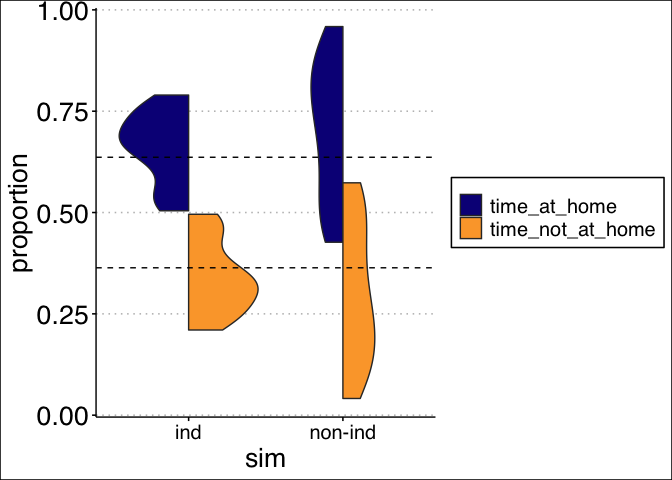

<!-- badges: start -->

[](https://codecov.io/gh/gavincotterill/modulr)
<!-- badges: end -->

# modulr

`modulr` is an R package for simulating fission-fusion dynamics and
sampling processes. It provides a suite of tools for creating and
working with modular `igraph` networks and investigating network
statistic estimation.

If using the ‘netcarto’ simulated-annealing community detection
algorithm implemented via `rnetcarto`, additional setup is required that
can be laborious, especially for Windows OS. In our experience, this
community detection algorithm has the greatest performance advantages
for small networks, which may make the additional setup effort
worthwhile.

## How to cite this package

Cotterill, G. modulr: R package for simulating fission-fusion networks
and sample design. (Version v1.0.0).
<https://github.com/gavincotterill/modulr>

## Installation

Currently only available through github. You will need to install and
load `devtools`.

``` r
install.packages("devtools")
devtools::install_github("gavincotterill/modulr")
```

## Use

A typical workflow consists of several steps:

1.  Consider a range plausible ‘true’ network configurations for your
    focal species. This includes network size (e.g., population size),
    number of subgroups (e.g., social groups), a range of
    group-switching rates and the duration of the period to track
    animals (e.g., a month, a year, etc.).

2.  Consider how animals are tracked. How many individuals will be
    tracked? How frequently will they be observed? Will individuals be
    selected from the population for tracking at random? Or in a
    stratified or clustered fashion? Additional choices will need to be
    made like the use of community detection algorithm.

3.  With these choices made, simulate a number of ‘true’ networks using
    `simulate_graph()` and calculate the desired network statistic(s).

4.  For each true network, simulate a number of sampling events using
    `sample_graph()` and estimate the desired network statistic(s)

5.  Visualize the results!

``` r
#------ load packages -----
sapply(c("tidyverse", "igraph", "assortnet", "modulr"), require, character = T)
#> tidyverse    igraph assortnet    modulr 
#>      TRUE      TRUE      TRUE      TRUE
```

``` r
set.seed(123)

#------ define true network configurations -------
true_design <- expand.grid(nNodes = 25, # total number of individuals in population
                           nModules = 4, # number of social groups
                           ttlg = c(10), # average "time to leave (home) group" in days
                           ttrg = c(1, 5, 7)) %>% # average "time to return (to home) group" in days
  filter(ttlg > ttrg) %>% # for the home group to be preferred, they have to spend more time there than away
  mutate(graph_id = row.names(.), # to keep track of networks
         qrel = NA) # placeholder for assortativity coefficients (Qrel)

#------ simulate your true networks --------
# additional arguments:
dur = 30 # how long to track animals in the population
smpl = "continuous" # The other option is "discrete".
spd = 2 # Because we're continuous, this is ignored.

# We recommend parallelizing your code, see vignettes for examples.
actual_graphs <- list()
for(p in 1:nrow(true_design)){
  actual_graphs[[p]] <- simulate_graph(n_animals = true_design$nNodes[p],
                                       n_groups = true_design$nModules[p],
                                       time_to_leave = true_design$ttlg[p],
                                       time_to_return = true_design$ttrg[p],
                                       travel_time = c(0.001, 1), # range of how long it takes for individuals to transition between groups
                                       sampling_duration = dur,
                                       sampler = smpl,
                                       samples_per_day = spd)
}


#----- calculate qrel for each network -----
# we use `assortnet` for this
for(m in 1:length(actual_graphs)){
  sim_igraph <- actual_graphs[[m]]
  adj_mat <- igraph::as_adjacency_matrix(sim_igraph, type = "upper", attr = "weight") %>% as.matrix()
  true_design$qrel[m] <- assortnet::assortment.discrete(adj_mat, types = V(sim_igraph)$membership, weighted = T)$r
}

# at this point you can check to see what you've got
g <- actual_graphs[[1]]
plot_simulated_graph(g, vertex.label = V(g), title = paste0("True Qrel = ", round(true_design[1, "qrel"], 2)))
```



This is a good check of our work so far. We should have 4 modules, and
25 nodes. Furthermore, the Fruchterman-Reingold layout should show us 4
distinct communities, since the group-switching rates we used ensure
reasonably high modularity.

Labeling the nodes (aka vertices) as we’ve done here can be useful. And
we can access the community membership of the graph in the normal
`igraph` fashion:

``` r
V(g)$membership
#>  [1] 3 4 1 1 4 3 3 4 4 3 2 3 3 3 2 3 4 4 2 2 4 1 4 1 1
```

Note that for the true memberships, no community detection algorithm is
needed. Each individual was assigned based on a random draw from a
uniform distribution initially.

``` r
#----- create sampling/study design ------
# out of the 25 individuals, we'll track 5, 10 and 15
df_nNodes <- data.frame(sample_nNodes = c(5, 10, 15))

# Here, we'll have all of our tracked animals will be observed 12 times per day
study_design <- tidyr::crossing(true_design, df_nNodes) %>%
  filter(sample_nNodes <= nNodes) %>%
  mutate(prop_hi_res = 0, # proportion of the animals observed according to hi_res rate
         hi_res = 12, # daily observation rate, high
         lo_res = 1/7, # daily observation rate, low (here it'll be ignored)
         qrel_sim = NA, # placeholder for calculation
         nModules_sim = NA) # placeholder for the number of communities we estimate
```

### Sampling

Let’s compare what we get back for modularity estimates using two
different community detection algorithms, “netcarto” and “fast_greedy”.

``` r
#------- sample using the 'grab-two' clustered algorithm ---------
# 'grab-two' samples two individuals from a social before sampling from another
# other options are 'random' or 'even'. 

out_nc <- list()
for(i in 1:nrow(study_design)){
  # grab a network
  graph_id <- as.numeric(study_design[[i, "graph_id"]])
  # sample it according to specs
  g_obs <- sample_graph(graph = actual_graphs[[graph_id]],
                        sample_nNodes = study_design$sample_nNodes[i],
                        prop_hi_res =  study_design$prop_hi_res[i],
                        hi_res = study_design$hi_res[i],
                        lo_res = study_design$lo_res[i],
                        sampling_duration = dur,
                        regime = "grab-two",
                        alg = "netcarto")
  # get the adjacency matrix for netcarto
  am_obs <- get.adjacency(g_obs, type = "upper", attr = "sim_weight") %>% as.matrix()
  # double check that membership exists
  try({ if( !is.null(V(g_obs)$membership) ){ colorOrder <- V(g_obs)$membership } })
  dat <- study_design[i,] %>% # calculate Qrel and store results
    mutate(qrel_sim = ifelse(exists("colorOrder"),
                             assortnet::assortment.discrete(am_obs, types = colorOrder, weighted = T)$r,
                             -666),
           nNodes_sim = ncol(am_obs), # might as well keep this in for now, double check that things are working
           nModules_sim = ifelse(exists("colorOrder"), length(unique(colorOrder)), -666))
  
  out_nc[[i]] <- list(dat, g_obs) # store the results and the sampled graph
}

# repeat with fast_greedy
out_fg <- list()
for(i in 1:nrow(study_design)){

  graph_id <- as.numeric(study_design[[i, "graph_id"]])
  
  g_obs <- sample_graph(graph = actual_graphs[[graph_id]],
                        sample_nNodes = study_design$sample_nNodes[i],
                        prop_hi_res =  study_design$prop_hi_res[i],
                        hi_res = study_design$hi_res[i],
                        lo_res = study_design$lo_res[i],
                        sampling_duration = dur,
                        regime = "grab-two",
                        alg = "fast_greedy")
  
  am_obs <- get.adjacency(g_obs, type = "upper", attr = "sim_weight") %>% as.matrix()
  try({ if( !is.null(V(g_obs)$membership) ){ colorOrder <- V(g_obs)$membership } })
  dat <- study_design[i,] %>% # calculate Qrel and store results
    mutate(qrel_sim = ifelse(exists("colorOrder"),
                             assortnet::assortment.discrete(am_obs, types = colorOrder, weighted = T)$r,
                             -666),
           nNodes_sim = ncol(am_obs), # might as well keep this in for now, double check that things are working
           nModules_sim = ifelse(exists("colorOrder"), length(unique(colorOrder)), -666))
  
  out_fg[[i]] <- list(dat, g_obs)
}


#------- investigate results ----------

res_nc <- lapply(out_nc, function(x) x[[1]]) %>%
  bind_rows() %>%
  mutate(regime = "grab-two",
         alg = "netcarto")

res_fg <- lapply(out_fg, function(x) x[[1]]) %>%
  bind_rows() %>%
  mutate(regime = "grab-two",
         alg = "fast_greedy")

res <- bind_rows(res_nc, res_fg)

# if there's only one module detected, impose qrel=0:
res <- res %>% mutate(qrel_sim = ifelse(qrel_sim == "NaN" & nModules_sim == 1, 0, qrel_sim))
# if the number of modules = the number of nodes (or nodes - 1 bc there's one edge), impose qrel = 1
res  <- res  %>%  mutate(qrel_sim = ifelse(qrel_sim == "NaN" & nModules_sim  %in% c(nNodes_sim, nNodes_sim - 1), 1, qrel_sim))

# calculate proportion of the population sampled 
res$prop_sampled <- round(res$sample_nNodes / res$nNodes, 2)

# calculate diff in estimate and truth
res$error <- res$qrel_sim - res$qrel

#------ plot a true network next to a sample of that network -----
par(mfrow = c(1,3))
plot_simulated_graph(actual_graphs[[1]], title = paste0("True Qrel = ", round(true_design[1, "qrel"], 2)))
plot_sampled_graph(g = actual_graphs[[1]], g_obs = out_nc[[2]][[2]], title = paste0("netcarto \nEst. Qrel = ", round(res_nc[2, "qrel_sim"], 2)))
plot_sampled_graph(g = actual_graphs[[1]], g_obs = out_fg[[2]][[2]], title = paste0("fast_greedy \nEst. Qrel = ", round(res_fg[2, "qrel_sim"], 2)))
```


`plot_sampled_graph()` preserves the layout from the corresponding
‘true’ network (which is why you have to provide that as the first
argument). This means that the nodes are in the same place so we can see
who was sampled, and the surrounding polygons are the same color
indicating the ‘true’ community membership. The *node* color in
`plot_sampled_graph()` shows us the communities that were assigned using
the algorithm we selected. These are be new colors. This is an
interesting example. It shows netcarto gets the communities (social
groups) and membership exactly right, but this time fast_greedy botched
it: it identified three, rather than 4, communities and put some
individuals together that don’t belong to the same group. As a result,
netcarto is able to estimate Qrel within .02, but fast_greedy is way
off. This isn’t always the case though, and in general modularity (Qrel)
can be robust to community detection issues relative to other
statistics, so it’s worth repeating this process a bunch of times.

``` r
alg_names <- c(netcarto = "\"netcarto\"", fast_greedy = "\"fast_greedy\"")
points_df <- res %>% select(qrel, qrel_sim, nNodes_sim, alg)
truth <- points_df %>% 
  slice(1:(nrow(res)/length(unique(alg)))) %>%
  select(qrel, nNodes_sim) %>%
  mutate(alg = "truth")
points <- merge(points_df, truth, all = T) %>%
  mutate(qrel_sim = ifelse(qrel_sim %in% NA, qrel, qrel_sim))


points %>%
  arrange(qrel) %>%
  mutate(index = 1:nrow(.)) %>%
  ggplot()+
  geom_point(aes(x = index, y = qrel_sim, color = alg), size = 5) +
  lims(y = c(0,1)) +
  labs(x = "", y = expression(hat(Q)["rel"]), color = "") +
  theme_bw() +
  facet_grid(~ nNodes_sim,
             labeller = labeller(nNodes_sim = as_labeller(function(x) paste0(x, " Nodes Observed")))) +
  theme(legend.title = element_text(size = 20),
        legend.text = element_text(size = 20),
        axis.text = element_text(size = 20),
        axis.title = element_text(size = 20),
        plot.title = element_text(size = 20),
        strip.background = element_rect(fill = "white"),
        strip.text = element_text(size = 20),
        panel.spacing.x = unit(1, "lines")) +
  guides(color = guide_legend(override.aes = list(size=5))) +
  scale_color_brewer(palette = "Set2")
#> Warning: Removed 2 rows containing missing values (geom_point).
```

 In practice we would want
to do this many more times using a broader range of parameter values.
There is a great deal of chance involved in sampling. How do the results
change when different individuals are selected for sampling? If you
change the `set.seed()` value, you will get different results! Although
we can’t say anything with much certainty based on this figure alone, it
suggests that perhaps netcarto leads to better Qrel (modularity)
estimates, especially at low rates of sampling (eg 5 nodes in a
population of 25).

## Graph crossing and individual-based disease model

There are some other cool things we can do, like ask, “how long does it
take for every individual in the network to directly or indirectly have
contact with one another?” I’m calling this ‘graph-crossing time’ and it
speaks the transmission potential of a network.

``` r
## first we need to simualte a network but get the data in a slightly different format
at <- animals_transformed(n_animals = 25,
                          n_groups = 4,
                          time_to_leave = 5,
                          time_to_return = 2,
                          travel_time = c(0.001, 1),
                          sampling_duration = 30)

## next we use the graph crossing function
# for now this is also a function that runs a recursive, individual-based SEIR model
# to get graph crossing, we'll need to set exposure time to zero and the infectious time
# to the length of the sampling duration
gc <- graph_crossing(animals_transformed = at[[1]],
                     exposure_time = 0,
                     infectious_time = 30,
                     index_case = "1") # we also need to select an index case individual
#> [1] "There are 25 animals in memo at the beginning of time_step 1"
#> [1] "There are 24 animals in memo the beginning of time_step 2"

# we get the graph crossing time (in days) like this:
max(gc$time_infected)
#> [1] 10.17639

# let's simulate a flu-like disease
seir <- graph_crossing(animals_transformed = at[[1]],
                       exposure_time = 2,
                       infectious_time = 3,
                       index_case = "1")
#> [1] "There are 25 animals in memo at the beginning of time_step 1"
#> [1] "There are 24 animals in memo the beginning of time_step 2"

# and we can plot the transmission chain
g_seir <- igraph::graph_from_edgelist(seir[,1:2] %>% as.matrix())

# plot the transmission chain
igraph::plot.igraph( g_seir, layout = igraph::layout.reingold.tilford,
                     edge.width = 1,
                     edge.arrow.width = 0.3,
                     vertex.size = 8,
                     edge.arrow.size = 0.5,
                     vertex.size2 = 5,
                     vertex.label.cex = .75,
                     asp = 0.35)
```


We’ve also got another simulator where individuals aren’t totally
independent actors. Here group transitions are a little more realistic.
We’ll use the same values as before and see how graph crossing and
transmission differ.

``` r
t2 <- simulate_non_independence(n_animals = 25,
                                n_groups = 4,
                                time_to_leave = 5,
                                time_to_return = 2,
                                travel_time = c(0.001, 1),
                                sampling_duration = 30)
# get list of ids:
t3 <- t2 %>%
  dplyr::group_by(start) %>%
  dplyr::summarise(mems = paste(members, collapse = "-")) %>%
  dplyr::mutate(mems = stringr::str_replace_all(mems, "/", "-")) %>%
  dplyr::mutate(mems = stringr::str_split(mems, "-"))
t4 <- lapply(t3$mems, unlist)
t5 <- purrr::map(t4, sort)
ids <- t5[[1]]

# convert to list of keyed data.tables
at_non_ind <- purrr::map(ids, ~t2[stringr::str_which(t2$members, .x),] %>%
                           dplyr::select(state, start, end) %>%
                           na.omit() %>%
                           dplyr::mutate_all(~as.numeric(.)) %>%
                           data.table::setDT() %>%
                           data.table::setkeyv(c("start", "end"))) %>%
  `names<-`(ids)

gc_non_ind <- graph_crossing(animals_transformed = at_non_ind,
                             exposure_time = 0,
                             infectious_time = 30,
                             index_case = "1_1")
#> [1] "There are 25 animals in memo at the beginning of time_step 1"
#> [1] "There are 24 animals in memo the beginning of time_step 2"
max(gc_non_ind$time_infected) # it took a lot longer this time
#> [1] 19.27047

# we'll overwrite that with the flu parameters we set before
gc_non_ind <- graph_crossing(animals_transformed = at_non_ind,
                             exposure_time = 2,
                             infectious_time = 3,
                             index_case = "1_1")
#> [1] "There are 25 animals in memo at the beginning of time_step 1"
#> [1] "There are 24 animals in memo the beginning of time_step 2"
#> [1] "There are 21 animals in memo the beginning of time_step 3"
#> [1] "There are 19 animals in memo the beginning of time_step 4"
#> [1] "ran out of new exposures at timestep 4"
g_non_ind <- graph_from_non_independence(t2)

g5 <- igraph::graph_from_edgelist(gc_non_ind[,1:2] %>% as.matrix())

# plot the transmission chain
igraph::plot.igraph( g5, layout = igraph::layout.reingold.tilford,
                     edge.width = 1,
                     edge.arrow.width = 0.3,
                     vertex.size = 8,
                     edge.arrow.size = 0.5,
                     vertex.size2 = 5,
                     vertex.label.cex = .75,
                     asp = 0.35)
```

 Transmission looks pretty
different from before. And the epidemic fades out really quickly, only
infecting \~ 1/3 of the population.
