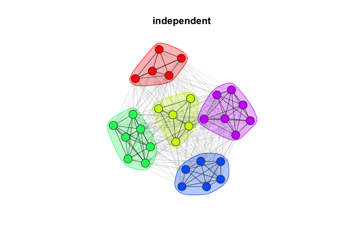

<!-- README.md is generated from README.Rmd. Please edit that file -->
<!-- badges: start -->

[](https://github.com/gavincotterill/modulr/actions)
[](https://app.codecov.io/gh/gavincotterill/modulr?branch=main)
<!-- badges: end -->

# modulr

`modulr` is primarily motivated by the investigation of transmission in
wildlife but could be extendable to other systems. The workflow starts
with simulating individual movement behaviors that give rise to emergent
network properties. Within a simulated population, individual-based
transmission and contact patterns can be investigated and network
sampling simulators facilitate power analysis for social network
statistic estimation. To our knowledge, it is also the first R package
to let users simulate networks with controllable modularity. The package
makes heavy use of ‘igraph’, especially for network visualization. Some
of the functions in this package can use the ‘netcarto’
simulated-annealing community detection algorithm implemented via
`rnetcarto`, although this is a suggested package, not a dependency.

## How to cite this package

Cotterill, G. and Manlove, K. modulr: R package to simulate individual
movement behaviors underlying modular fission-fusion networks. (Version
v0.8.0). <https://github.com/gavincotterill/modulr>

## Installation

Currently only available through github. You will need to install and
load `devtools`.

``` r
install.packages("devtools")
devtools::install_github("gavincotterill/modulr", build_vignettes = TRUE)
```

### Graph simulation

There are currently three different simulators. For more details, check
out the “Simulator Comparison” vignette. To illustrate some aspects of
this package this readme will use the “independent” sampler where all
individuals in the network move about independently.

``` r
#------ load packages -----
sapply(c("tidyverse", "ggthemes", "igraph", "assortnet", "modulr"),
    require, character = T)
#> tidyverse  ggthemes    igraph assortnet    modulr 
#>      TRUE      TRUE      TRUE      TRUE      TRUE
```

We start by specifying some parameters:

``` r
ng = 5  # number of groups in the network
na = 30  # number of animals in the network
tl = 7  # average number of days spent at a home patch before leaving
tr = 2  # average number of days spent at a non-resident patch before returning home
tt = c(0.01, 0.04)  # travel time distribution while switching (multiply by 1440 minutes per day: between ~15 minutes to an hour to switch groups)
sd = 100  # sampling/observation duration in days
```

Then we make a call to `simulate_schedule()`, specifying the simulator
to use.

``` r
set.seed(123)
ind <- simulate_schedule(n_animals = na, n_groups = ng, time_to_leave = tl,
    time_to_return = tr, travel_time = tt, sampling_duration = sd,
    simulator = "independent")
head(ind[[1]], 6)
#>    state      start        end
#> 1: 3.000  0.0000000  0.2210415
#> 2: 0.043  0.2210415  0.2520415
#> 3: 2.000  0.2520415  2.2355619
#> 4: 0.025  2.2355619  2.2665619
#> 5: 3.000  2.2665619 21.2657038
#> 6: 0.091 21.2657038 21.2797038
```

Each of these schedule objects is a list of data.frames, one per
individual, detailing where they were with time intervals. We can use
the “schedule” object `ind` for a few different things including making
an `igraph` graph with `graph_from_schedule()`, which we can plot using
`plot_simulated_graph()`.

``` r
g <- graph_from_schedule(ind)
plot_simulated_graph(g, title = "independent", vertex.size = 25,
    mark.expand = 25)
```

<!-- -->

Here, each circle (aka node) represents an individual. The color of the
node represents it’s home group and the polygon encircling nodes of the
same color are an additional aid in visualizing group memberships. The
darkness of the lines indicate the edge weights – that is, darker lines
mean more time spent together.

### Modularity

While we’re here we can convert this to an adjacency matrix, pull the
group membership for each animal, and calculate the network modularity
(Newman’s Q).

``` r
Q <- q_rel(g)
Q
#> [1] 0.5442307
```

### Sampling

The package also includes simulators for sampling procedures. This is
particularly useful if we want to know the accuracy with which we can
estimate network statistics. A frequent assumption is that individuals
are sampled at random, but in practice, this isn’t the case in many
wildlife systems – especially if there are distinct social groups. For
instance, with bighorn sheep that are captured for monitoring using
helicopter net-gunning, you’re more likely to end up with a handful of
animals from a few groups. We go into more details on this in other
vignettes, so here we’ll just proceed with the random sampling
assumption to illustrate the basics using `sample_graph()`. We’ll use it
to sample 10 animals (one third of the 30 in our population) and they’ll
be monitored for 100 days. Not all animals will be monitored with the
same frequency: half will be monitored daily, and the other half will be
monitored weekly. Last we’ll apply the “netcarto” community detection
algorithm from `rnetcarto` to make our best guess at what the social
groupings should be in this sampled graph.

``` r
sn <- 10
set.seed(123)
g_obs <- sample_graph(graph = g, sample_nNodes = sn, sampling_duration = sd,
    prop_hi_res = 0.5, hi_res = 1, lo_res = 1/7, regime = "random",
    alg = "netcarto")
```

Let’s calculate estimated modularity of the sampled graph.

``` r
Qest <- q_rel(g_obs)
Qest
#> [1] 0.5091914
```

Now we can plot our sampled graph side-by-side with the original and
compare. Using the optional `seed` call, and providing the same value to
both plotting functions, let’s us ‘lock’ the node layout in place to
facilitate side-by-side comparison of the ‘true’ and ‘observed’ graphs.

``` r
par(mfrow = c(1, 2))
seed_val <- 123
plot_simulated_graph(g, title = paste0("True Q = ", round(Q,
    2)), seed = seed_val)
plot_sampled_graph(g_obs = g_obs, g = g, title = paste0("Estimated Q = ",
    round(Qest, 2)), seed = seed_val)
```

<!-- -->

Netcarto’s community assignments are represented as the node color in
the right hand figure and the encircling polygons indicate the “true
membership” in both left and right. By chance, all 5 social groups were
sampled, and netcarto correctly assigned all individuals except the
white node up top, which should have been in it’s own group. Different
community detection algorithms vary in their strengths and abilities –
some will perform better if the observation frequency is reduced. As we
can see the estimated modularity ended up being a little low, but not
too far off.

Be sure to check out the other vignettes to learn more about `modulr`!
