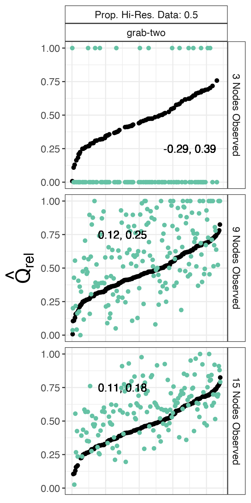

```{r, include = FALSE}
knitr::opts_chunk$set(
  collapse = TRUE,
  comment = "#>"
)
```

## Setup
[repo]: https://github.com/gavincotterill/modulr

This vignette assumes you've already installed `modulr` and its dependencies. If you haven't already, check out our README on [github][repo].
One of the community detection algorithms this package uses is netcarto, implemented via `rnetcarto`. The installation of this package can be difficult depending on your OS, and will likely be another vignette down the road. For now, we'll assume you haven't installed it.

We will build on our README example, and parallelize our code.

## To Recap:
A typical workflow consists of several steps:

1) Consider a range plausible 'true' network configurations for your focal species. This includes network size (eg population size), number of subgroups (eg social groups), and a range of group-switching rates, and the duration of the period to track animals (eg a month, a year).

2) Consider how animal tracking proceeds. How many individuals will be tracked? How frequently will they be observed? Will individuals be selected for tracking at random? Or in a stratified or clustered fashion? Additional choices will need to be made like the use of community detection algorithm.

3) With these choices made, simulate a number of 'true' networks using `simulate_graph()` and calculate the desired network statistic(s).

4) For each true network, simulate a number of sampling events using `sample_graph()` and estimate the desired network statistic(s)

5) Visualize the results!

```{r, include = FALSE}
#---- load packages --------
sapply(c("tidyverse", "igraph", "assortnet", "foreach", "doParallel", "modulr"), require, character = T)
```

```{r true design, eval = FALSE}
#------- param space to evaluate ---------------------
df <- do.call(rbind, list(data.frame(nNodes = 25, nModules = c(2:5)),
                          data.frame(nNodes = 50, nModules = c(2:10)),
                          data.frame(nNodes = 75, nModules = c(2:15))))


params <- expand.grid(ttlg = c(10, 20), ttrg = c(3, 5, 9, 12))

true_design <- merge(df, params) %>%
  filter(ttlg > ttrg) %>%
  mutate(graph_id = row.names(.),
         qrel = NA)

#------- additional arguments to function ------

spd = 1 # samples per day
dur = 30 # sample duration
```

We're growing our parameter space, so even in parallel this is going to take a few minutes (on my laptop using 3 cores this takes 6 minutes).
To keep it quick, I'm going to use discrete time, but feel free to make yours continuous. That will add computational time. Be warned.

```{r actual graphs, eval = FALSE}
#----- simulate graphs in parallel ----
registerDoParallel(3)
actual_graphs <- list()
start <- Sys.time()
actual_graphs <- foreach(p = 1:nrow(true_design)) %dopar%{
  out <- simulate_graph(n_animals = true_design$nNodes[p],
                        n_groups = true_design$nModules[p],
                        time_to_leave = true_design$ttlg[p],
                        time_to_return = true_design$ttrg[p],
                        sampling_duration = dur,
                        sampler = "discrete",
                        samples_per_day = spd)
  return(out)
}
end <- Sys.time()
end - start
```

I definitely recommend that you save your work as you go. Modify the filepath as needed.
Make sure you calculate your network statistics on the 'true' networks. Here I'm calculating modularity using `assortnet`.

```{r calculate true qrel, eval = FALSE}
saveRDS(actual_graphs, "./actual_graphs.RDS")

#----- calculate qrel for each network -----
for(m in 1:length(actual_graphs)){
  sim_igraph <- actual_graphs[[m]]
  adj_mat <- igraph::as_adjacency_matrix(sim_igraph, type = "upper", attr = "weight") %>% as.matrix()
  true_design$qrel[m] <- assortnet::assortment.discrete(adj_mat, types = V(sim_igraph)$membership, weighted = T)$r
}
```

Next we're going to make a study design data.frame. I'll let the number of sampled nodes vary 3:75, so long as the sampled number is less than the total number of nodes in the true network.

```{r sampling design, eval = FALSE}
#----- create sampling/study design ------
df_nNodes <- data.frame(sample_nNodes = 3:75)

study_design <- tidyr::crossing(true_design, df_nNodes) %>%
  filter(sample_nNodes <= nNodes) %>%
  mutate(prop_hi_res = NA,
         hi_res = NA,
         lo_res = NA,
         qrel_sim = NA,
         nModules_sim = NA)
```

### Now we're ready to do some sampling!

I'm just going to use the fast_greedy algorithm here from `igraph`. Ultimately we'll take a look at how the absolute number of sampled nodes affects our estimation of Qrel. If you want to investigate varying levels of observational intensity, use the vector approach on prop_hi_res. Note that `sample_graph()` 'hi_res' and 'lo_res' currently need to be expressed as the number of observations over a 365 day period, even if your sampling duration is short. This will likely change in the future.

```{r sampling, eval = FALSE}
#--------- recover qrel with varying levels of data quality ------------

# you can plug in a vector like so:
# prop_hi_res <- c(0, 0.25, .5, 0.75, 1)
# but for the sake of time I'm going to pick a single value. The loop below will support the vector though.
prop_hi_res <- c(0.5)
hi_res <- 30/365 # 
lo_res <- 5/365 #

#------- sample using the 'grab-two' clustered algorithm ---------
```

On a laptop with three available cores, this took ~11 minutes, so let it run and take a walk.

```{r sampl graph, eval = FALSE}
start <- Sys.time()
out_grab_two <- foreach(i=1:nrow(study_design), .combine = 'c', .errorhandling = "stop")%:%
  foreach(k=1:length(prop_hi_res))%dopar%{
    graph_id <- as.numeric(study_design[[i, "graph_id"]])
    
    g_obs <- sample_graph(graph = actual_graphs[[graph_id]],
                          sample_nNodes = study_design$sample_nNodes[i],
                          prop_hi_res =  prop_hi_res[k],
                          hi_res = hi_res,
                          lo_res = lo_res,
                          regime = "grab-two",
                          alg = "fast_greedy")
    
    am_obs <- get.adjacency(g_obs, type = "upper", attr = "sim_weight") %>% as.matrix()
    
    # there's some built in error-handling here for corner cases
    try({
      if( !is.null(V(g_obs)$membership) ){
        colorOrder <- V(g_obs)$membership
      }
    })
    dat <- study_design[i,] %>%
      mutate(prop_hi_res = prop_hi_res[k],
             hi_res = round(hi_res, 2), 
             lo_res = round(lo_res, 2),
             qrel_sim = ifelse(exists("colorOrder"),
                               assortnet::assortment.discrete(am_obs, types = colorOrder, weighted = T)$r,
                               -666),
             nNodes_sim = ncol(am_obs), # might as well keep this in for now, double check that things are working
             nModules_sim = ifelse(exists("colorOrder"), length(unique(colorOrder)), -666))
    
    list(dat, g_obs)
  }
end <- Sys.time()
end - start

saveRDS(out_grab_two, "./out_grab_two.RDS")

```
 
Don't forget to save! (And adapt the filepath.) 

### Now we've got some results to look at!

The object we made in the last step is actually a list of lists. There are other ways to do this, but this one works for me. That means we've got to do a little bit of data transformation. If you're not used to working with lists or `magrittr` piping (`%>%`), you may already dislike this script. At any rate, we're going to first extract the first element of all of our lists, which are data.frames with modularity results and other network specs. Then we bind all of the rows of those data.frames into a single data.frame and remind ourselves which sampling regime and community detection algortihm we chose in the previous step.

```{r list extract, eval = FALSE}
#------- investigate results ----------
res_gt <- lapply(out_grab_two, function(x) x[[1]]) %>%
  bind_rows() %>%
  mutate(regime = "grab-two",
         alg = "fast_greedy")

```

For modularity estimation, we have another decision to make. There will be cases when we can't calculate the statistic, either because all of our sampled nodes were deemed to be in a single community by the detection algorithm (in which case I'm enforcing Qrel = 0), or at the other extreme, all of the sampled nodes were deemed to be in unique communities or there are just very few edges (in which case I'm enforcing Qrel = 1). These usually only occur at very low levels of sampling, but you can choose to handle these scenarios in whatever way you think makes the most sense.

```{r zeros and ones, fig.height=30, fig.width=10, eval = FALSE}
# if there's only one module detected, impose qrel=0:
res <- res_gt %>% mutate(qrel_sim = ifelse(qrel_sim == "NaN" & nModules_sim == 1, 0, qrel_sim))
# if the number of modules = the number of nodes (or nodes - 1 bc there's one edge), impose qrel = 1
res  <- res  %>%  mutate(qrel_sim = ifelse(qrel_sim == "NaN" & nModules_sim  %in% c(nNodes_sim, nNodes_sim - 1), 1, qrel_sim))
```

Next I'm going to calculate the proportion of the population that was sampled, and the difference between true Qrel and our estimate. Lastly, I'm going to average across shared sampling space for the sampled graphs with relatively low levels of monitoring to calculate the mean and sd of the differences between Q and Qrel. This means I'm grouping together graphs with different configurations and group switching rates (which won't be known for the most part in the real world) to look at the range of error produced by my sampling design. We're going to plot those numbers against the raw estimates.

You'll need to install the `ggh4x` package if you want to use `facet_nested`. Here it isn't really needed, but it makes this code adaptable in the case where you want side-by-side comparisons with another factor level. For exampled, if you used the `prop_hi_res` vectored approach or if you re-ran the sampling with another community detection algorithm or sampling regime.

```{r vis, fig.height=10, fig.width=5, eval = FALSE}
# calculate proportion of the population sampled
res$prop_sampled <- round(res$sample_nNodes / res$nNodes, 2)

# calculate diff in estimate and truth
res$error <- res$qrel_sim - res$qrel

# now we're going calculate error mean and precision across shared sampling space to assess the quality of our estimates
test <- res %>% 
  filter(prop_sampled >= 0.05 & prop_sampled <= 0.5) %>% # when we've got 5-24% of the population monitored
  arrange(qrel) %>%
  mutate(index = 1:nrow(.)) %>%
  group_by(regime, prop_hi_res, sample_nNodes) %>%
  summarise(mean_bias = mean(error) %>% round(2),
            sd_bias = sd(error) %>% round(2))

res2 <- left_join(res, test, by = c("regime", "prop_hi_res", "sample_nNodes")) %>%
  mutate(bias_sign = ifelse(mean_bias < 0, "negative", "positive"))

res3 <- res2 %>% 
  filter(prop_sampled >= 0.05 & prop_sampled <= 0.5,
         sample_nNodes %in% c(3, 9, 15))

# note that I'm using the `ggh4x` package for its facet_nested function. This is an awesome package, you should go and download it now.

f4 <- res3 %>% 
  arrange(qrel) %>%
  mutate(index = 1:nrow(.)) %>%
  ggplot() +
  geom_point(aes(x = index, y = qrel), color = "black") +
  geom_point(aes(x = index, y = qrel_sim, color = regime)) +
  lims(y = c(0,1)) +
  labs(x = "", y = expression(hat(Q)["rel"])) +
  theme_bw() +
  theme(axis.title.x=element_blank(),
        axis.text.x=element_blank(),
        axis.ticks.x=element_blank(),
        axis.text.y = element_text(size = 10),
        axis.title.y = element_text(size = 20),
        strip.background = element_rect(fill = "white"),
        strip.text = element_text(size = 10),
        legend.position = "none") +
  geom_text(aes(x = ifelse(mean_bias < 0, 0.35e3, 0.15e3), y = ifelse(mean_bias < 0, .25, .75), label = paste0(mean_bias, ", ", sd_bias)),
            color = "black") +
  ggh4x::facet_nested(sample_nNodes ~ prop_hi_res + regime,
                      labeller = labeller(sample_nNodes = as_labeller(function(x) paste0(x, " Nodes Observed")),
                                          prop_hi_res = as_labeller(function(x) paste0("Prop. Hi-Res. Data: ", x)))) +
  scale_color_brewer(palette = "Set2")

f4

```
```{r, out.width = "400px", include = FALSE}

```

Phew! Finally some results! Here the x-axis is just an index for the different true networks. It has no biological interpretation. But I ordered them by true network modularity (the black dots) for ease of interpretation. I also trimmed down the number of panels for different levels of sampled nodes. Note that with only three animals sampled we don't have useable results-- it's all zeros and ones. Even with 15 sampled animals we've got over 10% average error on the Qrel estimate. Granted, this is averaged over a bunch of network configurations and some of the estimates look right on the money. In general though, we would want to investigate this further and also compare results using other community detection algorithms.


