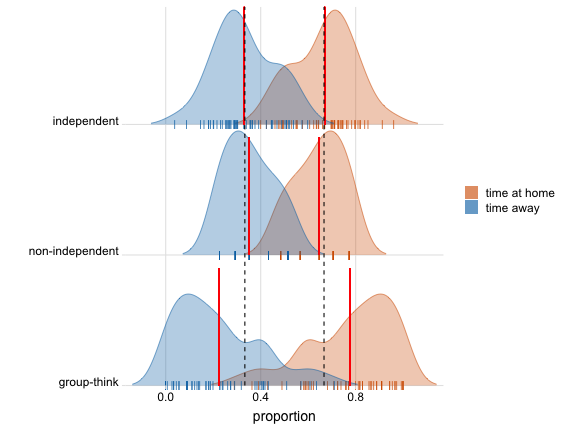
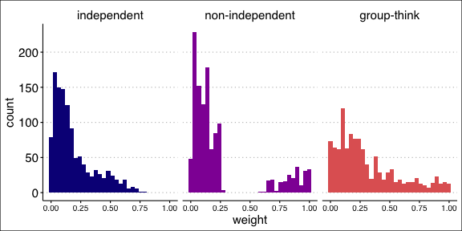
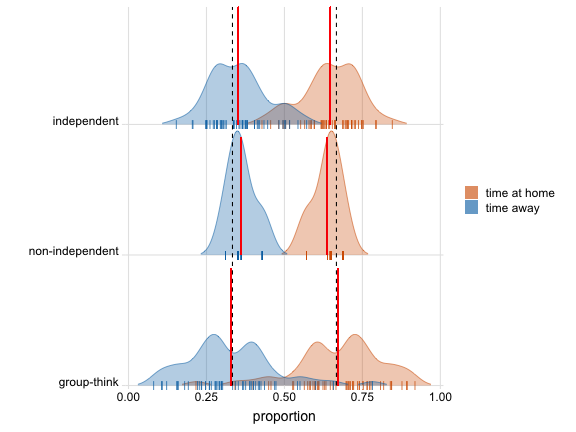
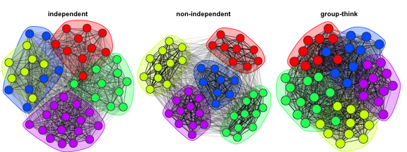

There are currently three simulators in the package called "independent", "non-independent" and "group-think". They are all spatially-explicit.

## "Independent"
In the independent simulator, changes in group membership arise from individual-level fission and fusion events that occur stochastically in accordance with fixed background rates. Each animal is initially assigned residency in a home group (which we can also think of as a patch) according to a draw from a discrete uniform distribution. We define an expected time to fission events, $\lambda$, that controls the stochastic waiting time to departure from the home group and an expected time to fusion events, $\xi$, that controls the stochastic waiting time until the animal returns to its home group. At the beginning of the simulation, we draw a waiting time until fission from an exponential distribution with rate parameter $1/\lambda$. At that time the individual is assigned to a new group drawn at random from a set containing all of its non-resident groups. Then another waiting time is drawn, this time from an exponential distribution governed by the fusion event rate $1⁄\xi$, at which time the animal returns to its resident home group. This procedure is repeated for the sampling duration.

The combination of switching times and group labels defines a continuous-time description of the individual's location (and who else was with them) over the course of the simulation. The simulation protocol assumes that the fission and fusion events of particular individuals are independent (e.g., larger groups do not preferentially split into subgroups; individuals join and leave groups one-at-a-time). Users must specify limits on the amount of time it takes for individuals to transition between groups. The duration of 'travelling time' for each transition is drawn from a uniform distribution using those limits. This flexibility also allows transitions to be nearly instantaneous and/or fixed at a precise value. Travelling time is factored into waiting times for the exponential draws. This means that users should specify travelling times that are short relative to $\lambda$ and $\xi$, otherwise individuals potentially spend more time in limbo than with groups. The simulation procedure is repeated independently for all individuals in the simulated population.

## "Non-independent"
In this simulator, individuals move between patches with members of their home group. Waiting times are drawn as in the independent simulator, but these are used to dictate when groups make transitions between home and away patches. When it's time to leave home, the group splinters into subgroups using the "n_splits" parameter. If fixed to a single value, all groups split into that number of subgroups. If n_splits is undefined (NA), then the number of subgroups travelling to different states increases with the size of the group. Whenever a group splits into subgroups, individuals are randomly sampled so that there is no fixed "subgroup membership". Subgroups use the travelling procedure outlined above as well. When it's time to return home, all subgroups depart their respective 'away' patches and return home at the same time as all other members of their home group. This relaxes the assumption that all individuals are independent actors while ensuring that individuals adhere to the user-defined group switching rates.

## "Group-think"

This simulator is a bit experimental and at first glance appears chaotic. Like the previous simulator, it does not assume independent switching. Unlike the previous two simulators, there is virtually no patch fidelity. Lastly, the rules governing group switching incorporate a bit more animal cognition. The group switching process works in two stages. First, whole groups are simulated that switch between patches using the independent simulation procedure. Second, groups are populated with resident individuals at the first time interval. For the remainder of the simulation individuals make movement decisions based on what is happening around them in terms of group movements and in conjunction with the rates $1/\lambda$ and $1/\xi$. At any time in the simulation there are four possible event types: fission, fusion, simultaneous fission and fusion or no change among the groups at a given patch. In a fission event, at least one group departs from a patch containing at least one other group; fusion is when groups join each other at a patch; fission-fusion is when groups are both arriving and departing a patch at the exact same time. Currently the trigger for individual decision-making is 'fission' of either variety: the departure of any group from multiple co-located groups (i.e., event types fission or fission-fusion). It is important to note that individuals can be 'attached' to a non-resident group while co-located with their resident group and vice-versa. Individual choice is structured such that, when *any fission* happens, individuals decide whether to trail off with those that are departing or stay put. In practice it's a little more complicated: individuals that are attached to their resident/home group have a probability of switching to any of the other previously co-located groups equal to $(1/\lambda) / ((1/\lambda) + (1/\xi))$ and individuals that are not attached to their resident/home group have a probability of returning to their respective home groups equal to $(1/\xi) / ((1/\lambda) + (1/\xi))$. Individuals returning home 'magically' find their resident group regardless of where they are located and are subject to the same uniform draw for travelling time. These individual movements have no bearing on the event types categorizing group movements (eg., fission, fusion, etc.) We'll explain the behavior of this simulator in further detail below.

Let's compare the simulators. We need to load some additional packages.

```r
sapply(c("modulr", "ggplot2", "ggthemes", "ggridges", "igraph"),
    require, character = TRUE)
#>   modulr  ggplot2 ggthemes ggridges   igraph 
#>     TRUE     TRUE     TRUE     TRUE     TRUE
```

We start by specifying values. Our population will consist of 50 animals distributed across 5 groups (there are also 5 patches). We'll leave `n_splits` undefined, so that larger groups will split into more subgroups. On average, individuals will spend 4 days with their home group before departing and be away from their home group for 2 days before returning. We'll simulate the process for 15 days. Currently all of the 'time' components are specified in days. There are 1440 minutes per day. $0.01 * 1440 = 14.4$ minutes. So we're dictating that travel times be drawn from a uniform distribution between about 15 minutes and 6 hours.


```r
n_groups = 5
n_animals = 50
n_splits = NA
time_to_leave = 4
time_to_return = 2
travel_time = c(0.01, 0.25)
sampling_duration = 15
```

We use the `simulate_schedule()` call to access the three simulators with one more parameter `simulator =` to pick which simulator to use. This will generate a list of data.frames (one per animal). Each named data.frame in the list is a continuous-time description of an individuals movements. This may not be the final data structure most users will want to employ, but it will give us what we need to make some useful comparisons between the simulators.


```r
# independent
set.seed(1234)
ind <- simulate_schedule(n_animals = n_animals, n_groups = n_groups,
    n_splits = n_splits, time_to_leave = time_to_leave, time_to_return = time_to_return,
    travel_time = travel_time, sampling_duration = sampling_duration,
    simulator = "independent")
```

Each data.frame has this structure, hence the name 'schedule':

```r
head(ind[[1]], 6)
#>    state     start       end
#> 1: 4.000 0.0000000 0.9783952
#> 2: 0.009 0.9783952 1.1373952
#> 3: 2.000 1.1373952 1.7489156
#> 4: 0.016 1.7489156 1.9239156
#> 5: 4.000 1.9239156 2.2679731
#> 6: 0.086 2.2679731 2.3799731
```

### Proportion of time spent 'home' vs. 'away'
Next I'll use the `get_times()` function to calculate the amount of time each individual spent at home vs. away.


```r
ids_ind <- names(ind)

out_ind <- get_times(schedule = ind[[1]], id = ids_ind[[1]],
    simulator = "independent")
for (i in 2:length(ids_ind)) {
    out_ind[i, ] <- get_times(ind[[i]], ids_ind[[i]], simulator = "independent")
}

paste("For the 'independent' simulator, the average proportion of time that individuals spent at their home patch was ",
    mean(out_ind$time_at_home) %>%
        round(., 3), ", versus the desired value of ", round(time_to_leave/(time_to_leave +
        time_to_return), 3))
#> [1] "For the 'independent' simulator, the average proportion of time that individuals spent at their home patch was  0.678 , versus the desired value of  0.667"
```

For the 'independent' and 'non-independent' simulators we expect these values to be pretty close. We repeat this procedure for the other two simulators. Note that the 'non-independent' and 'group-think' simulators are much slower when there are a hundred or more animals.


```r

# non-independent
set.seed(1234)
non_ind <- simulate_schedule(n_animals = n_animals, n_groups = n_groups,
    n_splits = n_splits, time_to_leave = time_to_leave, time_to_return = time_to_return,
    travel_time = travel_time, sampling_duration = sampling_duration,
    simulator = "non-independent")
ids_ni <- names(non_ind)

out_ni <- get_times(schedule = non_ind[[1]], id = ids_ni[[1]],
    simulator = "non-independent")

for (i in 2:length(ids_ni)) {
    out_ni[i, ] <- get_times(non_ind[[i]], ids_ni[[i]], simulator = "non-independent")
}

paste("For the 'non-independent' simulator, the average proportion of time that individuals spent at their home patch was ",
    mean(out_ni$time_at_home) %>%
        round(., 3), ", versus the desired value of ", round(time_to_leave/(time_to_leave +
        time_to_return), 3))
#> [1] "For the 'non-independent' simulator, the average proportion of time that individuals spent at their home patch was  0.664 , versus the desired value of  0.667"

# group-think
gt <- simulate_schedule(n_animals = n_animals, n_groups = n_groups,
    n_splits = n_splits, time_to_leave = time_to_leave, time_to_return = time_to_return,
    travel_time = travel_time, sampling_duration = sampling_duration,
    simulator = "group-think")
ids_gt <- names(gt)
```

For the group-think simulator, these values are going to be farther off. For one, individuals don't have the same fidelity to a patch as in the previous simulators, so if we judge the simulator's reliability on the basis of the proportion of time they spent at their 'quasi-home' patch, it will be pretty far off. In order to do this, we have to 'trick' `get_times()` by giving it a different simulator name:


```r
out_gt <- get_times(schedule = gt[[1]], id = ids_gt[[1]], simulator = "independent")

for (i in 2:length(ids_gt)) {
    out_gt[i, ] <- get_times(gt[[i]], ids_gt[[i]], simulator = "independent")
}

paste("For the 'group-think' simulator, the average proportion of time that individuals spent at their quasi-home patch was ",
    mean(out_gt$time_at_home) %>%
        round(., 3), ", versus the desired value of ", round(time_to_leave/(time_to_leave +
        time_to_return), 3))
#> [1] "For the 'group-think' simulator, the average proportion of time that individuals spent at their quasi-home patch was  0.357 , versus the desired value of  0.667"
```

A better judge of it's performance is the amount of time individuals spent attached to the core of their home group, which floats around between patches. We'll just overwrite the previous objects, but this time we give `get_times()` the correct simulator name:


```r
out_gt <- get_times(schedule = gt[[1]], id = ids_gt[[1]], simulator = "group-think")

for (i in 2:length(ids_gt)) {
    out_gt[i, ] <- get_times(gt[[i]], ids_gt[[i]], simulator = "group-think")
}

paste("For the 'group-think' simulator, the average proportion of time that individuals spent with their core group was ",
    mean(out_gt$time_at_home) %>%
        round(., 3), ", versus the desired value of ", round(time_to_leave/(time_to_leave +
        time_to_return), 3))
#> [1] "For the 'group-think' simulator, the average proportion of time that individuals spent with their core group was  0.748 , versus the desired value of  0.667"
```

In this example it's in the ballpark. With a longer sampling duration and more individuals it would be closer. We can reshape the data and plot the distributions of time home vs. away for all individuals in the three simulations.


```r
out <- out_ind %>%
    dplyr::mutate(sim = "independent") %>%
    rbind(out_ni %>%
        dplyr::mutate(sim = "non-independent")) %>%
    rbind(out_gt %>%
        dplyr::mutate(sim = "group-think"))

out2 <- out %>%
    tidyr::gather(state, proportion, 3:4)

# reorder
out2$sim <- factor(out2$sim, levels = c("group-think", "non-independent",
    "independent"))

ggplot(out2, aes(x = proportion, y = sim, color = state, point_color = state,
    fill = state)) + geom_density_ridges(jittered_points = TRUE,
    scale = 0.95, rel_min_height = 0.01, point_shape = "|", point_size = 3,
    size = 0.25, position = position_points_jitter(height = 0)) +
    scale_y_discrete(expand = c(0, 0), name = "") + scale_x_continuous(expand = c(0,
    0), name = "proportion") + scale_fill_manual(values = c("#D55E0050",
    "#0072B250"), labels = c("time at home", "time away")) +
    scale_color_manual(values = c("#D55E00", "#0072B2"), guide = "none") +
    scale_discrete_manual("point_color", values = c("#D55E00",
        "#0072B2"), guide = "none") + coord_cartesian(clip = "off") +
    guides(fill = guide_legend(override.aes = list(fill = c("#D55E00A0",
        "#0072B2A0"), color = NA, point_color = NA))) + theme_ridges(center = TRUE) +
    geom_vline(aes(xintercept = time_to_leave/(time_to_leave +
        time_to_return)), lty = 2) + geom_vline(aes(xintercept = time_to_return/(time_to_leave +
    time_to_return)), lty = 2) + theme(legend.title = element_blank())
#> Picking joint bandwidth of 0.078
```



The two dashed vertical lines are our 'targets' based on the group-switching rates we provided. These look fine, but non-independent and group-think are a little chaotic. Note the rug plot (short lines along the x-axis) are showing individual results. Whereas in the independent simulator there are more distinct lines (because individuals are independent actors), in the non-independent simulator more of these lines are stacked on one another because more individuals end up with the same values by virtue of switching with other members of their group.

We don't always want to work on a list of data.frames, so let's employ the `graph_from_schedule()` call to create `igraph` graph objects. At these values each of these calls took about 30 seconds with 50 individuals.


```r
# compare graphs
g_ind <- graph_from_schedule(ind)
g_ni <- graph_from_schedule(non_ind)
g_gt <- graph_from_schedule(gt)

class(g_ind)
#> [1] "igraph"
```

It's that simple. Now we can plot them with `plot_simulated_graph()`.


```r
par(mfrow = c(1, 3), oma = c(0, 0, 1, 0), mar = c(0, 0, 2, 0),
    xpd = NA)
plot_simulated_graph(g_ind, vertex.size = 35, title = "independent")
plot_simulated_graph(g_ni, vertex.size = 35, title = "non-independent")
plot_simulated_graph(g_gt, vertex.size = 35, title = "group-think")
```


Here, each circle (or node) represents an individual. The color of the node represents it's home group and the polygon encircling nodes of the same color are an additional aid in visualizing group memberships. The darkness of the lines indicate the edge weights -- that is, darker lines mean more time spent together. Between the graphs we have the same number of individuals and the same number of groups, but these are three totally different simulations so they will still be different in terms of how many animals are in each group and the arrangement of colors. However, what is potentially meaningful are differences in terms of how the communities here segregate or don't and the edge weights.

### Edge weights
Let's look at the distribution of edge weights from these graphs:


```r
# compare edge weight distributions
ew_ind <- igraph::E(g_ind)$weight
ew_non_ind <- igraph::E(g_ni)$weight
ew_gt <- igraph::E(g_gt)$weight

df2 <- data.frame(weight = c(ew_ind, ew_non_ind, ew_gt), sim = c(rep("independent",
    length(ew_ind)), rep("non-independent", length(ew_non_ind)),
    rep("group-think", length(ew_gt))))
df2$sim = factor(df2$sim, levels = c("independent", "non-independent",
    "group-think"))

ggplot(df2) + geom_histogram(mapping = aes(x = weight, fill = sim),
    show.legend = FALSE) + scale_fill_viridis_d(option = "plasma",
    end = 0.6) + facet_wrap(~sim) + theme_clean() + theme(axis.title = element_text(size = 20/2),
    axis.text.x = element_text(size = 15/2), axis.text.y = element_text(size = 20/2),
    strip.text = element_text(size = 20/2))
#> `stat_bin()` using `bins = 30`. Pick better value with `binwidth`.
```



```r

mean(ew_ind)
#> [1] 0.2101041
mean(ew_non_ind)
#> [1] 0.2624169
mean(ew_gt)
#> [1] 0.2755224
```

Each edge weight represents the proportion of time that two individuals (dyads) spent together over the course of the simulation. With longer sampling duration and more individuals these will converge toward the 'indepedent' edge weight distribution, but over this short period 'non-independent' has more dyads that never split apart, as does 'group-think'.

### Modularity

Another way to compare these graphs is in their modularity -- the namesake of this package. We'll convert these graphs to matrices and use the `assortnet` package to calculate this statistic (Newman's Q).


```r
adj_ind <- as.matrix(igraph::get.adjacency(g_ind, type = "upper",
    attr = "weight"))
mem_ind <- igraph::V(g_ind)$membership
assortnet::assortment.discrete(adj_ind, types = mem_ind, weighted = T)$r
#> [1] 0.3856603

adj_ni <- as.matrix(igraph::get.adjacency(g_ni, type = "upper",
    attr = "weight"))
mem_ni <- igraph::V(g_ni)$membership
assortnet::assortment.discrete(adj_ni, types = mem_ni, weighted = T)$r
#> [1] 0.541657

adj_grp <- as.matrix(igraph::get.adjacency(g_gt, type = "upper",
    attr = "weight"))
mem_grp <- igraph::V(g_gt)$membership
assortnet::assortment.discrete(adj_grp, types = mem_grp, weighted = T)$r
#> [1] 0.3596103
```

We could have predicted that the non-independent simulator would produce a higher modularity value than the others based on everything we've said up to this point. In general, if we provide the same parameters to the three simulators and give them a long enough simulation duration relative to the group-switching rates, they should yield modularity values in the same ball-park.

Rather than take my word for it, let's do a longer run with a larger network. We'll create a network of 150 animals distributed across 13 groups (and patches). That should give us some bigger differences in group sizes. We'll double the sampling time to 30 days and leave all else the same.


```r
n_groups = 13
n_animals = 150
n_splits = NA
time_to_leave = 4
time_to_return = 2
travel_time = c(0.01, 0.25)
sampling_duration = 30

# independent
set.seed(1234)
ind <- simulate_schedule(n_animals = n_animals, n_groups = n_groups,
    n_splits = n_splits, time_to_leave = time_to_leave, time_to_return = time_to_return,
    travel_time = travel_time, sampling_duration = sampling_duration,
    simulator = "independent")

ids_ind <- names(ind)

out_ind <- get_times(schedule = ind[[1]], id = ids_ind[[1]],
    simulator = "independent")
for (i in 2:length(ids_ind)) {
    out_ind[i, ] <- get_times(ind[[i]], ids_ind[[i]], simulator = "independent")
}

paste("For the 'independent' simulator, the average proportion of time that individuals spent at their home patch was ",
    mean(out_ind$time_at_home) %>%
        round(., 3), ", versus the desired value of ", round(time_to_leave/(time_to_leave +
        time_to_return), 3))
#> [1] "For the 'independent' simulator, the average proportion of time that individuals spent at their home patch was  0.66 , versus the desired value of  0.667"

# non-independent
set.seed(1234)
non_ind <- simulate_schedule(n_animals = n_animals, n_groups = n_groups,
    n_splits = n_splits, time_to_leave = time_to_leave, time_to_return = time_to_return,
    travel_time = travel_time, sampling_duration = sampling_duration,
    simulator = "non-independent")
ids_ni <- names(non_ind)

out_ni <- get_times(schedule = non_ind[[1]], id = ids_ni[[1]],
    simulator = "non-independent")

for (i in 2:length(ids_ni)) {
    out_ni[i, ] <- get_times(non_ind[[i]], ids_ni[[i]], simulator = "non-independent")
}

paste("For the 'non-independent' simulator, the average proportion of time that individuals spent at their home patch was ",
    mean(out_ni$time_at_home) %>%
        round(., 3), ", versus the desired value of ", round(time_to_leave/(time_to_leave +
        time_to_return), 3))
#> [1] "For the 'non-independent' simulator, the average proportion of time that individuals spent at their home patch was  0.636 , versus the desired value of  0.667"

# group-think
gt <- simulate_schedule(n_animals = n_animals, n_groups = n_groups,
    n_splits = n_splits, time_to_leave = time_to_leave, time_to_return = time_to_return,
    travel_time = travel_time, sampling_duration = sampling_duration,
    simulator = "group-think")
ids_gt <- names(gt)

out_gt <- get_times(schedule = gt[[1]], id = ids_gt[[1]], simulator = "group-think")

for (i in 2:length(ids_gt)) {
    out_gt[i, ] <- get_times(gt[[i]], ids_gt[[i]], simulator = "group-think")
}

paste("For the 'group-think' simulator, the average proportion of time that individuals spent with their core group was ",
    mean(out_gt$time_at_home) %>%
        round(., 3), ", versus the desired value of ", round(time_to_leave/(time_to_leave +
        time_to_return), 3))
#> [1] "For the 'group-think' simulator, the average proportion of time that individuals spent with their core group was  0.725 , versus the desired value of  0.667"
```

These values are all pretty close.


```r
out <- out_ind %>%
    dplyr::mutate(sim = "independent") %>%
    rbind(out_ni %>%
        dplyr::mutate(sim = "non-independent")) %>%
    rbind(out_gt %>%
        dplyr::mutate(sim = "group-think"))

out2 <- out %>%
    tidyr::gather(state, proportion, 3:4)

# reorder
out2$sim <- factor(out2$sim, levels = c("group-think", "non-independent",
    "independent"))

ggplot(out2, aes(x = proportion, y = sim, color = state, point_color = state,
    fill = state)) + geom_density_ridges(jittered_points = TRUE,
    scale = 0.95, rel_min_height = 0.01, point_shape = "|", point_size = 3,
    size = 0.25, position = position_points_jitter(height = 0)) +
    scale_y_discrete(expand = c(0, 0), name = "") + scale_x_continuous(expand = c(0,
    0), name = "proportion") + scale_fill_manual(values = c("#D55E0050",
    "#0072B250"), labels = c("time at home", "time away")) +
    scale_color_manual(values = c("#D55E00", "#0072B2"), guide = "none") +
    scale_discrete_manual("point_color", values = c("#D55E00",
        "#0072B2"), guide = "none") + coord_cartesian(clip = "off") +
    guides(fill = guide_legend(override.aes = list(fill = c("#D55E00A0",
        "#0072B2A0"), color = NA, point_color = NA))) + theme_ridges(center = TRUE) +
    geom_vline(aes(xintercept = time_to_leave/(time_to_leave +
        time_to_return)), lty = 2) + geom_vline(aes(xintercept = time_to_return/(time_to_leave +
    time_to_return)), lty = 2) + theme(legend.title = element_blank())
#> Picking joint bandwidth of 0.0445
```



Now 'indepedent' and 'non-independent' have converged to similar distributions. 'Group-think' still looks chaotic, albeit better. Because of what's happening behind this scenes this isn't a perfect comparison for this simulator, so let's withhold judgment until we look at the graphs.


```r
# compare graphs
g_ind <- graph_from_schedule(ind)
g_ni <- graph_from_schedule(non_ind)
g_gt <- graph_from_schedule(gt)

par(mfrow = c(1, 3), oma = c(0, 0, 1, 0), mar = c(0, 0, 2, 0),
    xpd = NA)
plot_simulated_graph(g_ind, vertex.size = 35, title = "independent")
plot_simulated_graph(g_ni, vertex.size = 35, title = "non-independent")
plot_simulated_graph(g_gt, vertex.size = 35, title = "group-think")
```



Now with 150 individuals, `the graph_from_schedule()` calls each took about 5 minutes. I'd like to speed a number of these functions up in the future, either with `rcpp` or discrete-time approximations. For those interested in producing larger graphs, the 'independent' sampler already has a discrete-time approximation called `simulate_graph()` where users specify the number of samples per day.

These generally look like the graphs we plotted earlier, just with a lot more individuals.


```r
# compare edge weight distributions
ew_ind <- igraph::E(g_ind)$weight
ew_non_ind <- igraph::E(g_ni)$weight
ew_gt <- igraph::E(g_gt)$weight

df2 <- data.frame(weight = c(ew_ind, ew_non_ind, ew_gt), sim = c(rep("independent",
    length(ew_ind)), rep("non-independent", length(ew_non_ind)),
    rep("group-think", length(ew_gt))))
df2$sim = factor(df2$sim, levels = c("independent", "non-independent",
    "group-think"))

ggplot(df2) + geom_histogram(mapping = aes(x = weight, fill = sim),
    show.legend = FALSE) + scale_fill_viridis_d(option = "plasma",
    end = 0.6) + facet_wrap(~sim) + theme_clean() + theme(axis.title = element_text(size = 20/2),
    axis.text.x = element_text(size = 15/2), axis.text.y = element_text(size = 20/2),
    strip.text = element_text(size = 20/2))
#> `stat_bin()` using `bins = 30`. Pick better value with `binwidth`.
```


```r

mean(ew_ind)
#> [1] 0.1104568
mean(ew_non_ind)
#> [1] 0.1409382
mean(ew_gt)
#> [1] 0.1441627
```

The edge weight distributions look more similar than in the previous example.


```r
adj_ind <- as.matrix(igraph::get.adjacency(g_ind, type = "upper",
    attr = "weight"))
mem_ind <- igraph::V(g_ind)$membership
assortnet::assortment.discrete(adj_ind, types = mem_ind, weighted = T)$r
#> [1] 0.4397975

adj_ni <- as.matrix(igraph::get.adjacency(g_ni, type = "upper",
    attr = "weight"))
mem_ni <- igraph::V(g_ni)$membership
assortnet::assortment.discrete(adj_ni, types = mem_ni, weighted = T)$r
#> [1] 0.5423323

adj_grp <- as.matrix(igraph::get.adjacency(g_gt, type = "upper",
    attr = "weight"))
mem_grp <- igraph::V(g_gt)$membership
assortnet::assortment.discrete(adj_grp, types = mem_grp, weighted = T)$r
#> [1] 0.3685951
```

The modularity scores haven't changed much from before. Independent increased from 0.38 to 0.44, the non-independent score is basically identical, and group-think has decreased very slightly -- although you might not guess it by looking at the graphs. Hopefully this describes the different simulators in a useful way. While 'independent' ensures consistent switching behavior across individuals, 'non-independent' ensures that individuals will adhere to their `friends` more closely. By comparison, 'group-think' generates heterogeneous behavior that falls somewhere in the middle: some individuals adhere closely to `friends` while others don't.

For another way of comparing the simulators, check out the 'graph crossing' vignette where we put these continuous-time schedules to work in an individually-based disease context.
